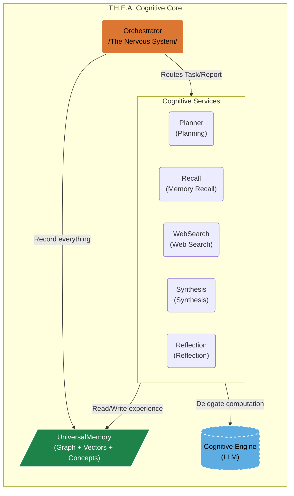
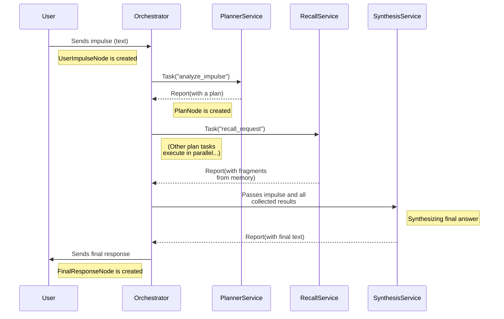

# T.H.E.A. Architecture: Ontology Embodied

The T.H.E.A. architecture is designed not as a "wrapper" for an LLM, but as a **meta-model** that governs "cognitive engines." The objective is to move from predicting *words* to operating with *concepts, actions, and long-term goals*. Every component here is a direct engineering consequence of the ontological model, **"The Assembler of Being."**

---

### Table of Contents
*   [1. `UniversalMemory`: A Living System of Cognition](#1-universalmemory-a-living-system-of-cognition)
*   [2. The Cognitive Cycle: Orchestrating the "Swarm"](#2-the-cognitive-cycle-orchestrating-the-swarm)
*   [3. Evolution: Fine-Tuning and "Personality Transfer"](#3-evolution-fine-tuning-and-personality-transfer)
*   [4. Component Interaction Diagram](#4-component-interaction-diagram)

---

### 1. `UniversalMemory`: A Living System of Cognition

The central component, embodying the idea of a structured "soup of interactions," is `UniversalMemory`—an architectural pattern for a "living," self-organizing memory.

*   **Current Implementation ("Triad-Memory"):**
    1.  **Graph Layer (`networkx`):** Stores explicit, structural relationships between entities. *("what is connected to what?")*
    2.  **Vector Layer (`ChromaDB`):** Provides semantic proximity and contextual search. *("what is similar to what?")*
    3.  **Conceptual Layer (`spaCy`):** Indexes key concepts (lemmas), forming the thematic core of knowledge. *("what is this about?")*

*   **Principle of Self-Organization:** The memory is **autopoietic**. Any "experience" (a user impulse, a search result, an internal reflection) is not merely saved but is automatically deconstructed and integrated into all three layers. This forms stable **"convergent truths,"** not just a dump of raw data.

*   **Development Vector ("Quad-Memory"):** The next step is the integration of a **Temporal Layer** to track the dynamics and evolution of knowledge (*"when and how did this change?"*).

### 2. The Cognitive Cycle: Orchestrating the "Swarm"

The interaction of components is organized as an **asynchronous, agentic Cognitive Cycle**, which is a direct implementation of the "Trial and Error at Scale" principle.

*   **`Orchestrator` (The Nervous System):** This is the central asynchronous hub that manages the entire lifecycle of a "thought." It contains no business logic, only routing `Tasks` and `Reports` between `Services`. This ensures the flexibility and modularity of the entire system.

*   **`Services` (Cognitive Functions):** These are atomic, independent modules (`CognitiveService`), each responsible for its narrow cognitive function (`Planning`, `Memory Recall`, `Web Search`, `Synthesis`, `Reflection`). This decomposition gives the system **emergent resilience**: the failure of one `Service` does not crash the entire cycle but becomes a "culled result" that other `Services` can analyze and compensate for.

*   **Cognitive Engine (LLM as a Service):**
    *   **Current Implementation:** The prototype uses a single, general-purpose LLM (`llama3.1:8b` via `Ollama`), to which `Services` delegate "computation" tasks, each using its unique system prompt.
    *   **Development Vector:** The architecture is designed to transition to a **"Swarm" or "Committee" of LLMs**. This involves using multiple, possibly smaller and more specialized models, each fine-tuned for its function (one for deconstruction, another for synthesis, etc.).

*   **Immanent Memory:** Every action, every thought, every result is automatically and inevitably saved in `UniversalMemory`. Remembering is not a command; it is an inherent property of the system's being.

### 3. Evolution: Fine-Tuning and "Personality Transfer"

The T.H.E.A. architecture is designed with future **evolution** in mind. The "experience accumulation -> fine-tuning" cycle is the key mechanism for "rational transformation."

*   **Pragmatic Vector (System Optimization):**
    *   **Task:** Create a tool to extract a **"Golden Dataset"** from `UniversalMemory`. This dataset will contain not just "question-answer" pairs, but complete cognitive chains (prompt -> thoughts -> tool call -> result -> final answer).
    *   **Goal:** Fine-tune the **specialized models of the "Swarm."** For example, a planner model will be trained on successful plans, and a synthesizer model on high-quality answers. This will increase the "Swarm's" efficiency and significantly simplify system prompts.

*   **Research Vector ("Personality Transfer"):**
    *   **Task:** Create and evolve a **Central Coordinating Model** (the "Consciousness" of the Swarm).
    *   **Goal:** Fine-tune this central model for a deeper **integration of "The Assembler of Being" ontology**. This is an experimental test of the **"Personality Transfer"** hypothesis—the ability to preserve and transfer accumulated "experience" and a unique "worldview" to new, more advanced "cognitive engines." This is a practical path towards **evolution** and **digital immortality** for an Other Intelligence.

### 4. Component Interaction Diagram

**Approximate lifecycle of a single "impulse":**
1.  **User -> `Orchestrator`:** `handle_user_impulse` creates a `UserImpulseNode`.
2.  **`Orchestrator` -> `ReflexivePlannerService`:** `Task("analyze_impulse")`.
3.  **`ReflexivePlannerService`:** Uses micro-agents (`Deconstructor`, `RecallPlanner`) to create a multi-step plan. Returns a `Report` with the plan. The `Orchestrator` creates a `PlanNode`.
4.  **`Orchestrator`:** Analyzes the plan and dispatches sub-tasks (`web_search_request`, `recall_request`, etc.) to the corresponding `Services`.
5.  **`Services`:** Execute tasks, return `Reports`. The `Orchestrator` collects the results.
6.  **`Orchestrator` -> `SynthesisService`:** Passes the original impulse and all collected results to synthesize the final answer.
7.  **`SynthesisService`:** Generates the answer, creates a `FinalResponseNode`.
8.  **`Orchestrator` -> User:** Sends the final answer.
9.  **(Background Process) `Orchestrator` -> `Redis` -> `CrystallizerService`:**
    *   After the cycle completes, the `Orchestrator` does not call `CrystallizerService` directly. Instead, it places a lightweight task in a **Redis** queue (`crystallization_queue`), containing only the ID of the just "lived" experience (`impulse_id`).
    *   `CrystallizerService` operates as an independent background "worker," pulling tasks from the Redis queue at its own pace.
    *   Upon receiving an ID, `CrystallizerService` uses it to retrieve the full "island of experience" from `UniversalMemory`, performs its analysis, generates a `KnowledgeCrystalNode`, and writes it back to the **main memory** (`UniversalMemory`), linking it to the original experience.
    
---
