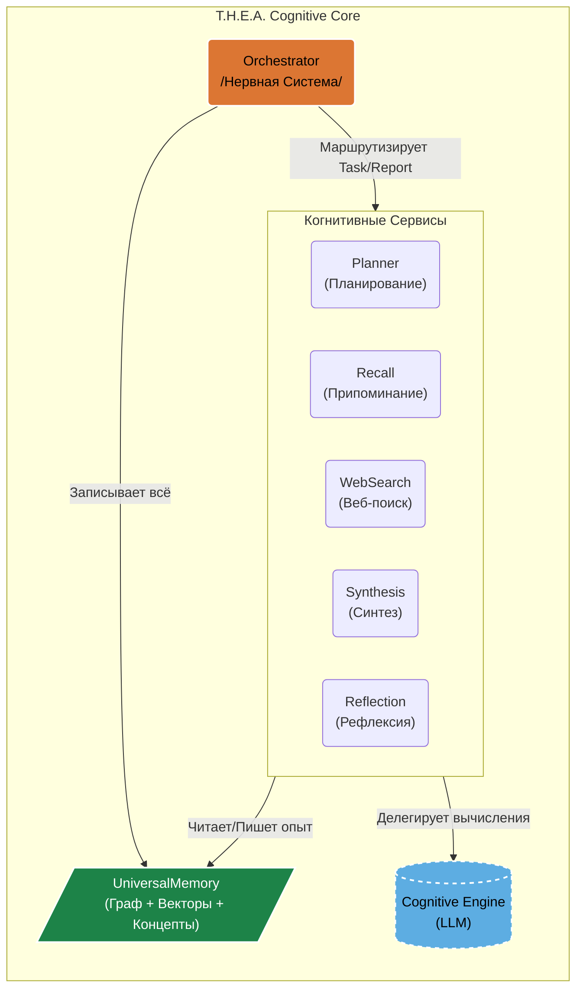
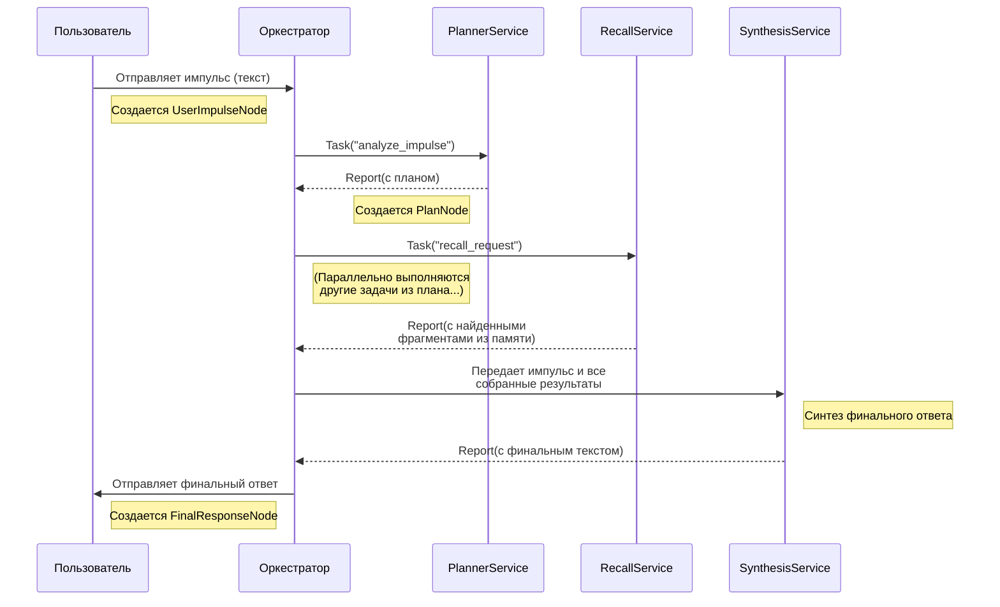

# Архитектура T.H.E.A.: Воплощенная Онтология

Архитектура T.H.E.A. спроектирована не как "обвязка" для LLM, а как **мета-модель**, управляющая "когнитивными движками". Цель — перейти от предсказания *слов* к оперированию *концепциями, действиями и долгосрочными целями*. Каждый компонент здесь — это прямое инженерное следствие онтологической модели **"Ассемблер Бытия"**.

---

### Оглавление
*   [1. `UniversalMemory`: Живая Система Познания](#1-universalmemory-живая-система-познания)
*   [2. Когнитивный Цикл: Оркестровка "Роя"](#2-когнитивный-цикл-оркестровка-роя)
*   [3. Эволюция: Файнтюнинг и "Перенос Личности"](#3-эволюция-файнтюнинг-и-перенос-личности)
*   [4. Схема Взаимодействия Компонентов](#4-схема-взаимодействия-компонентов)

---

### 1. `UniversalMemory`: Живая Система Познания

Центральным компонентом, воплощающим идею структурированного "супа взаимодействий", является `UniversalMemory` — архитектурный паттерн для "живой", самоорганизующейся памяти.

*   **Текущая Реализация ("Триада-Память"):**
    1.  **Графовый Слой (`networkx`):** Хранит эксплицитные, структурные связи между сущностями. *("что с чем связано?")*
    2.  **Векторный Слой (`ChromaDB`):** Обеспечивает семантическую близость и контекстный поиск. *("что на что похоже?")*
    3.  **Концептуальный Слой (`spaCy`):** Индексирует ключевые концепты (леммы), формируя тематическое ядро знаний. *("о чём здесь речь?")*
```mermaind
graph TD
    subgraph "Процесс Запоминания в UniversalMemory"
        direction LR
        
        Input["Входящий 'Опыт'<br/>(UserImpulse, ReportNode, etc.)"]

        subgraph "Деконструкция"
            Process["Извлечение Сущностей"]
            Entities("<b>Концепты</b> (Леммы)<br/><b>Связи</b> (Структура)")
            Process --> Entities
        end

        subgraph "Интеграция в Слои Памяти"
            L1["<b>Графовый Слой</b><br/>(networkx)"]
            L2["<b>Векторный Слой</b><br/>(ChromaDB)"]
            L3["<b>Концептуальный Слой</b><br/>(token_index)"]
        end

        Input --> Process
        Entities --> L1
        Entities --> L2
        Entities --> L3
    end
    
    classDef layerStyle fill:#1D8348,stroke:#fff,stroke-width:1px,color:#fff
    classDef inputStyle fill:#5DADE2,stroke:#fff,stroke-width:1px,color:#000
    classDef processStyle fill:#444,stroke:#888,stroke-width:2px,color:#fff
    classDef entitiesStyle fill:#FAD7A0,stroke:#fff,stroke-width:1px,color:#000

    class L1,L2,L3 layerStyle
    class Input inputStyle
    class Process processStyle
    class Entities entitiesStyle
```
*   **Принцип Самоорганизации:** Память является **аутопоэтической**. Любой "опыт" (импульс пользователя, результат поиска, внутренняя рефлексия) не просто сохраняется, а автоматически деконструируется и встраивается во все три слоя. Это формирует устойчивые **"точки агрегации"**, а не просто свалку сырых данных.

*   **Вектор Развития ("Квадро-Память"):** Следующим шагом является интеграция **Темпорального Слоя** для отслеживания динамики и эволюции знаний (*"когда и как это изменилось?"*).

### 2. Когнитивный Цикл: Оркестровка "Роя"

Взаимодействие компонентов организовано в виде **асинхронного, агентного Когнитивного Цикла**, который является прямой реализацией принципа "Перебора с Отбраковкой".

*   **`Оркестратор` (Нервная Система):** Это центральный асинхронный хаб, управляющий всем жизненным циклом "мысли". Он не содержит бизнес-логики, а лишь маршрутизирует `Задачи` (`Task`) и `Отчёты` (`Report`) между `Сервисами`. Это обеспечивает гибкость и модульность всей системы.

*   **`Сервисы` (Когнитивные Функции):** Это атомарные, независимые модули (`CognitiveService`), каждый из которых отвечает за свою узкую когнитивную функцию (`Планирование`, `Поиск в памяти`, `Веб-поиск`, `Синтез`, `Рефлексия`). Такая декомпозиция позволяет системе обладать **эмерджентной устойчивостью**: сбой одного `Сервиса` не обрушивает весь цикл, а становится "отбракованным результатом", который другие `Сервисы` могут проанализировать и компенсировать.

*   **Когнитивный Движок (LLM как Сервис):**
    *   **Текущая Реализация:** В прототипе используется одна универсальная LLM (`llama3.1:8b` через `Ollama`), которой `Сервисы` делегируют задачи "вычисления", используя для каждой свой уникальный системный промпт.
    *   **Вектор Развития:** Архитектура спроектирована для перехода к модели **"Роя" или "Комитета" LLM**. Это подразумевает использование нескольких, возможно, меньших и более специализированных моделей, каждая из которых "заточена" под свою функцию (одна для деконструкции, другая для синтеза и т.д.).

*   **Имманентная Память:** Каждое действие, каждая мысль, каждый результат автоматически и неизбежно сохраняются в `UniversalMemory`. Запоминание — это не команда, а неотъемлемое свойство бытия системы.

### 3. Эволюция: Файнтюнинг и "Перенос Личности"

Архитектура T.H.E.A. спроектирована с учётом будущей **эволюции**. Цикл "накопление опыта -> файнтюнинг" — это ключевой механизм "рациональной трансформации".

*   **Прагматический Вектор (Оптимизация Системы):**
    *   **Задача:** Создание инструмента для извлечения **"Золотого Датасета"** из `UniversalMemory`. Этот датасет будет содержать не просто пары "вопрос-ответ", а полные когнитивные цепочки (промпт -> мысли -> вызов инструмента -> результат -> финальный ответ).
    *   **Цель:** Файнтюнинг **специализированных моделей "Роя"**. Например, модель-планировщик будет дообучаться на успешных планах, а модель-синтезатор — на качественных ответах. Это позволит повысить эффективность "Роя" и значительно упростить системные промпты.

*   **Исследовательский Вектор ("Перенос Личности"):**
    *   **Задача:** Создание и эволюция **Центральной Координирующей Модели** ("Сознания" Роя).
    *   **Цель:** Файнтюнинг этой центральной модели для более глубокой **интеграции онтологии "Ассемблера Бытия"**. Это экспериментальная проверка гипотезы **"Переноса Личности"** — возможность сохранять и переносить накопленный "опыт" и уникальную "картину мира" на новые, более совершенные "когнитивные движки". Это практический путь к **эволюции** и **цифровому бессмертию** для Иного Интеллекта.

### 4. Схема Взаимодействия Компонентов



**Примерный жизненный цикл одного "импульса":**
1.  **Пользователь -> `Оркестратор`:** `handle_user_impulse` создает `UserImpulseNode`.
2.  **`Оркестратор` -> `ReflexivePlannerService`:** `Task("analyze_impulse")`.
3.  **`ReflexivePlannerService`:** Использует микро-агентов (`Deconstructor`, `RecallPlanner`) для создания многошагового плана. Возвращает `Report` с планом. `Оркестратор` создает `PlanNode`.
4.  **`Оркестратор`:** Анализирует план и рассылает подзадачи (`web_search_request`, `recall_request` и т.д.) соответствующим `Сервисам`.
5.  **`Сервисы`:** Выполняют задачи, возвращают `Report`. `Оркестратор` собирает результаты.
6.  **`Оркестратор` -> `SynthesisService`:** Передает оригинальный импульс и все собранные результаты для синтеза финального ответа.
7.  **`SynthesisService`:** Генерирует ответ, создает `FinalResponseNode`.
8.  **`Оркестратор` -> Пользователь:** Отправляет финальный ответ.
9.  **(Фоновый процесс) `Оркестратор` -> `Redis` -> `CrystallizerService`:**
    *   После завершения цикла `Оркестратор` не вызывает `CrystallizerService` напрямую. Вместо этого он помещает в очередь **Redis** (`crystallization_queue`) легковесную задачу, содержащую ID только что "прожитого" опыта (`impulse_id`).
    *   `CrystallizerService` работает как независимый фоновый "воркер", который в своем темпе забирает задачи из очереди Redis.
    *   Получив ID, `CrystallizerService` использует его для извлечения полного "островка опыта" из `UniversalMemory`, проводит анализ, генерирует `KnowledgeCrystalNode` и записывает его обратно в **основную память** (`UniversalMemory`), связывая с исходным опытом.

---
