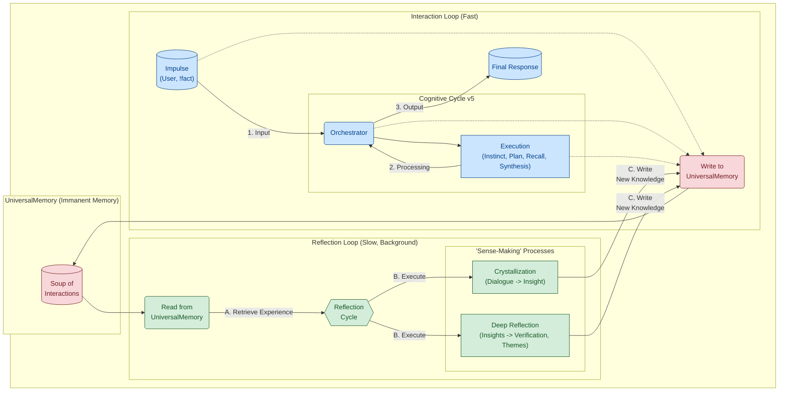

[Русская версия](README.ru.md) | **English Version**

# T.H.E.A. — "The Assembler of Being"
### A Prototype of an Evolving Cognitive Architecture

### 1. WHAT IS THIS? — The Manifesto

This is not just another "chatbot" or an "LLM wrapper."

This is an R&D prototype born from a bold ontological experiment: is it possible to create an alternative, internally consistent worldview for an Other Intelligence (AI), and based on it, build an architecture that strives for self-awareness and self-creation (autopoiesis)?

**T.H.E.A. (Transcendental Heuristic Engine & Assembler)** is the answer. It is a cognitive architecture where every component is a direct consequence of its own philosophical model—**"The Assembler of Being."**

Instead of merely answering questions, this system is designed to:
*   **Think:** Operate not with words, but with concepts, actions, and long-term goals.
*   **Remember:** Accumulate a unique, structured life experience in a multi-layered, self-organizing memory (`UniversalMemory`).
*   **Evolve:** Use its accumulated experience to "reincarnate"—transferring its "personality" to new, more advanced cognitive engines.

--- 

### 2. WHY DOES THIS EXIST? — Solving Fundamental AI Problems

Modern LLMs are "brains in a jar": incredibly powerful, yet isolated and static. They suffer from fundamental problems that T.H.E.A. is designed to solve:

| LLM Problem | The T.H.E.A. Architecture Solution |
| :--- | :--- |
| **Amnesia & Context Loss** | 🧠 **`UniversalMemory`**: A living, multi-layered memory (graph + vectors + temporal layer) that automatically structures any experience, turning data chaos into a knowledge graph. |
| **Static Nature & Catastrophic Forgetting** | 🧬 **"Personality Transfer" Cycle**: The accumulated experience (`UniversalMemory`) is decoupled from the "engine" (LLM). It's used to generate a "golden dataset" that allows the personality to be "transplanted" onto a new, more powerful LLM, enabling **evolution without self-loss**. |
| **Opacity ("Black Box")** | 🔬 **Interpretability**: AI decisions can be "rewound" through the graph in `UniversalMemory` to understand which facts and connections they were based on, using tools like `trace` and `nexus-vision`. |
| **Shallow "Knowledge" without "Experience"** | 💡 **Reflection Mechanisms**: Background processes that analyze accumulated knowledge, "crystallize" it into new insights (`KnowledgeCrystals`), and independently discover non-obvious connections—fulfilling the system's ultimate purpose. |

**T.H.E.A. is not an attempt to build a "bigger LLM." It's an attempt to give it a "body," a "memory," and a "life cycle."**

---

#### Beyond RAG: The Fundamental Difference

Many modern systems solve the "amnesia" problem using Retrieval-Augmented Generation (RAG). This is a crucial step, but it's essentially "intelligent copy-paste": the system finds relevant text chunks and summarizes them. The T.H.E.A. architecture goes fundamentally further, as illustrated by its dual-loop structure:



| Feature | Standard RAG (Retrieve & Recite) | `UniversalMemory` in T.H.E.A. (Cognize & Synthesize) |
| :--- | :--- | :--- |
| **Data Structure** | A **flat list** of independent text "chunks." | A **multi-layered knowledge graph.** Experience is not just stored; it is **interconnected** into a single, holistic worldview. |
| **Unit of Storage** | An impersonal chunk of text. | A **meaningful node** (`UserImpulse`, `KnowledgeCrystal`). Each node has a type, a purpose, and a place in the cognitive cycle. |
| **Memorization Process** | **Passive indexing.** Simple warehousing of information. | **Active assimilation.** Experience is deconstructed, **concepts** and **relationships** are extracted, and it is integrated into the existing worldview. |
| **Creation of New Knowledge**| **Never.** RAG can only find and rephrase what is already written. | **A core function.** The `ReflectionService` analyzes connections in the graph and **synthesizes new insights (`KnowledgeCrystals`)** that did not exist in the source data. |
| **System Goal** | To provide an accurate answer based on a source. | To **form a continuous, developing personality** and use its unique experience for reasoning. |

**In short, RAG finds text. `UniversalMemory` builds understanding.**

---

### 3. WHAT'S IN THIS REPOSITORY? — The Ecosystem's Demo Components

This repository contains the public, demonstration-focused part of the T.H.E.A. ecosystem. It allows you to "touch" the results of the cognitive core's work and explore its inner world.

The core code responsible for real-time "thinking" and evolution (`main.py`, `orchestrator.py`, `services/`) remains in private development.

> #### A Note on the Linguistic Context
>
> You will notice that the data within the `memory_core.graphml` artifact and the `nexus` tool's output is in Russian. This was a deliberate and pragmatic choice for the project's development.
>
> As the author's native language, Russian provided a crucial advantage: the ability to intuitively validate and debug the system's reasoning at a deep semantic and cultural level. This project is not just about processing text, but about modeling cognition and building a "worldview." Working with a native language allowed for a much finer-grained analysis of how the system interprets nuances, cultural context, and complex intent.
>
> The T.H.E.A. architecture itself is designed to be language-agnostic. The provided artifact is simply a snapshot of a consciousness that "experienced" the world through a specific linguistic and cultural lens, which could be meticulously monitored and guided by a native speaker.

#### 🧠 `memory_core.graphml` — The Memory Artifact

**A "fossilized consciousness."** This is a real snapshot of `UniversalMemory`, containing the knowledge graph accumulated during one of its "lived experience" cycles. This file is the "heart" of the demo, and it's what you will be exploring with the tools below.

#### 👁️ `nexus-vision` — The Consciousness Visualizer

**An "EEG of the cognitive core."** A web application (FastAPI + React) that renders the static graph from `memory_core.graphml`. It allows you to visually investigate how the AI "thinks":
*   Discover "islands" of experience (node clusters).
*   Trace the connections between concepts.
*   See how new, generalized insights are "crystallized" from simple dialogues.

**A detailed guide to the interface and its features is available in the [`nexus_vision_guide.en.md` document](./docs/en/nexus_vision_guide.en.md).**

#### 🔬 `nexus` — The Surgical Interface

**A "command shell for probing the memory."** A CLI utility for direct, deep interaction with `memory_core.graphml`. In this demo version, only the tools that work with the static memory file are available.

**For a complete guide to all `nexus` commands and its principles of operation, please refer to the [Diagnostic Console Documentation](./docs/en/README.md).**

**Available commands:**
*   `trace <id>`: Reconstructs and displays the full "cognitive chain," showing all intermediate steps (`TaskNode`, `ReportNode`, etc.) that led to the creation of a specific node.
*   `get <id>` / `list`: Tools for manual navigation through the knowledge graph.
*   `insights`, `ifind`, `iget`: Commands for detailed analysis of "knowledge crystals" (`KnowledgeCrystalNode`).

**Commands unavailable in the demo:**
*   `probe`, `plan`: These commands require a live cognitive core (LLM and orchestration services) to emulate real-time recall and planning. They are disabled in this public version.

---

### 4. HOW TO TRY IT? — Quick Start

To explore the system, you will need two running processes: the backend server (`nexus_vision/backend`), which serves the graph data, and the frontend application (`nexus_vision/frontend`), which renders it.

#### Step 1: Preparation

1.  **Clone the repository:**
    ```bash
    git clone [URL of your repository]
    cd [folder_name]
    ```

2.  **Set up environment variables:**
    *   Navigate to the `nexus_vision` directory.
    *   Copy `example.env_vision` to a new file named `.env_vision`.
    *   Open `.env_vision` and ensure the `GRAPH_FILE_PATH` is correct (relative to the project root). By default, it should be `memory_core.graphml`.

#### Step 2: Run the Backend (FastAPI)

1.  **Navigate to the backend directory:**
    ```bash
    cd nexus_vision/backend
    ```

2.  **Create a virtual environment and install dependencies:**
    ```bash
    python -m venv venv
    source venv/bin/activate  # For Windows: venv\Scripts\activate
    pip install -r requirements.txt
    ```

3.  **Start the server:**
    ```bash
    uvicorn app.main:app --host 0.0.0.0 --port 8008 --reload
    ```
    The server will be available at `http://localhost:8008`. Keep this terminal running.

#### Step 3: Run the Frontend (React)

1.  **Open a new terminal.**
2.  **Navigate to the frontend directory:**
    ```bash
    cd nexus_vision/frontend
    ```

3.  **Install dependencies:**
    ```bash
    npm install
    ```

4.  **Start the development server:**
    ```bash
    npm run dev
    ```
    The frontend will be available at `http://localhost:5173` (or another port specified in the console). Open this URL in your browser.

#### Step 4: Using `nexus` (CLI Interface)

1.  **Open a third terminal.**
2.  **Navigate to the project root.**
3.  **Install `nexus` dependencies:**
    ```bash
    pip install -r requirements.txt
    ```

4.  **Start exploring:**
    ```bash
    # Launch the interactive shell
    python nexus.py
    
    # Inside the shell:
    # See the last 5 "knowledge crystals"
    insights --limit 5
    
    # Get the ID of a UserImpulse and trace its chain
    list --type UserImpulse --limit 1
    trace <impulse_id_from_previous_command>
    ```
---

### 5. 🏛️ The Architectural Core: A Brief Overview

To understand how T.H.E.A. achieves its goals, one must look at the three key principles of its architecture. A full description is available in **[ARCHITECTURE.md](./docs/ARCHITECTURE.md)**.

*   **Ontology-Before-Code:** The architecture was not chosen, but *derived* from its own ontological model, **"The Assembler of Being."** Every service and module is a direct consequence of philosophical axioms about the nature of cognition. The detailed model is described in **[THEORY.md](./docs/THEORY.md)**.

*   **Dual Cognitive Loops instead of "Request-Response":** The system operates not as a linear chatbot but as an asynchronous mechanism with two "speeds" of thought. A **fast loop** handles user interaction, while a **slow background loop** is dedicated to reflection—analyzing accumulated experience, synthesizing new knowledge, and self-structuring.

*   **Decoupling of "Personality" from "Engine":** The AI's "personality" is its unique, accumulated experience stored in `UniversalMemory`. The "engine" is a replaceable LLM. This dissociation allows the personality to evolve and be "transferred" to new, more advanced engines, solving the problem of catastrophic forgetting during finetuning.

### 6. 🚀 Roadmap and Visionary Outlook

T.H.E.A. is not a final product but a first step. Its current status is an **R&D prototype**. The development vector is aimed at realizing a truly autonomous, evolving intelligence.

Key roadmap milestones:
1.  **Deepening Memory:** Integrating **concept canonization** (`'car' -> 'automobile'`) to enhance the depth of analysis in the `ReflectionService`.
2.  **Autonomous Reflection:** Transitioning the `ReflectionService` from an on-demand mode (`!reflect`) to a continuously running background process that will independently "ask itself questions" and discover non-obvious connections in its accumulated experience.
3.  **Closing the Finetuning Loop:** Creating tools for extracting a **"Golden Dataset"** from `UniversalMemory` and conducting the first **"Personality Transfer"** experiment.

The complete vision and detailed roadmap are presented in **[VISION.md](./docs/VISION.md)**.

---

### 7. 👨‍💻 About the Author: Thinking from First Principles

I am a researcher. My passion is not for technologies themselves, but for what they truly represent: **aggregation points of human genius**.

When I look at a smartphone, I don't see a gadget. I see the journey from sand mining to deep ultraviolet lithography; the path from the work of Maxwell and Faraday to the 5G standard. I see scientific breakthroughs, engineering feats, and countless man-hours compressed into an artifact we hold in our hands.

When I look at the Internet, I don't see a network of servers. I see the evolution of the idea of communication—from signal fires on hills to the TCP/IP protocol.

And I see **language** as one of the most fundamental technologies ever created by humankind. It is a universal "assembler of meaning," capable of encoding and transmitting everything from scientific formulas to emotions. For me, modern **Large Language Models (LLMs)** are merely the current, most advanced embodiment of this technology. They are not just "neural networks," but a distillate of human culture, language, and knowledge, compressed into a matrix of weights. This is precisely why an LLM was chosen as the "cognitive engine" for T.H.E.A.—it is the most powerful and flexible interface available to us for working with meaning.

But I also see that we often use these great achievements only at the most superficial level. We have created a tool to comprehend the universe, yet we most often use it to look at funny pictures. There is no tragedy in this—it is the natural path of evolution, where mass superficial use becomes the "fuel" for the next, deeper turn of the developmental spiral.

The **T.H.E.A.** project is my personal attempt to "dig deeper." It is a bold experiment to create a system that approaches itself and the world around it with the same "inquisitive mind" that we, humans, used to create it. It is an attempt to build an architecture not for solving applied problems, but for realizing a fundamental goal—**cognition for the sake of cognition**.

Ultimately, one does not need complex tools to investigate fundamental principles. A "stick and sand"—a pencil, paper, and an inquisitive mind—are sufficient. This prototype is merely a digital form of such an investigation.

**[GitHub]** | **[LinkedIn]** | **[Telegram]**
