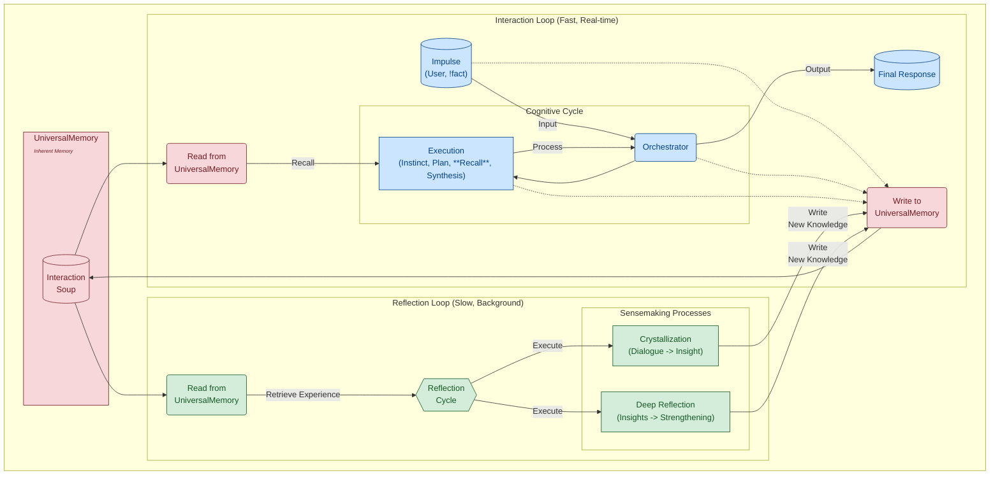

[Русская версия](README.ru.md) | **English Version**

# T.H.E.A. — An Experimental Cognitive Architecture with Persistent Memory
### An R&D prototype of a stateful architecture for LLM-based agents

### 1. What is this project about?

This repository contains an R&D prototype exploring an alternative approach to building systems with Large Language Models (LLMs). Instead of treating an LLM as a stateless tool, T.H.E.A. (Transcendental Heuristic Engine & Assembler) proposes an architecture where the LLM acts as a "cognitive core" within a larger, stateful system.

The core idea is to move beyond simple "request-response" cycles to a system capable of:
*   **Accumulating Experience:** Persisting all interactions in a structured, multi-layered memory (`UniversalMemory`).
*   **Reflecting on Experience:** Using background processes to analyze accumulated data and synthesize new, generalized insights.
*   **Evolving (Theoretically):** Decoupling the "memory" from the "core" to create a theoretical pathway for transferring accumulated experience to new, more advanced models.

---

### 2. What problems does it explore?

Modern LLMs have several inherent limitations. This project explores architectural patterns to mitigate some of them:

| LLM Limitation                    | Architectural Approach in T.H.E.A.                                                                                                                                                                                                                                                                                                           |
| :-------------------------------- | :------------------------------------------------------------------------------------------------------------------------------------------------------------------------------------------------------------------------------------------------------------------------------------------------------------------------------------------- |
| **Amnesia & Context Loss**        | 🧠 **`UniversalMemory`**: A persistent, multi-layered memory (graph + vectors + time) that automatically structures all experiences, rather than just holding them in a short-term context window.                                                                                                                                            |
| **Static Nature of Models**       | 🧬 **Decoupling Memory from Core**: The accumulated experience (`UniversalMemory`) is separate from the "engine" (LLM). This offers two advantages: <br> 1. **Evolution:** The experience can be used to fine-tune new, more powerful LLMs. <br> 2. **Knowledge Injection:** Data can be loaded directly into the structured memory, which the system then "assimilates" through reflection. |
| **"Black Box" Problem**           | 🔬 **External Observability**: We don't know *what* happens inside the LLM, but `UniversalMemory` acts as a **"flight recorder,"** logging every step of the cognitive process. This allows for "incident investigation" at an architectural level using the `trace` tool.                                                              |
| **Lack of "Personal Experience"** | 💡 **Reflection Mechanisms**: Background processes analyze past dialogues. If two concepts frequently appear together in different contexts, the system **synthesizes an "insight"—a hypothesis about their relationship**—gradually forming its own experience-based "understanding" of the world.                                 |

**T.H.E.A. is not an attempt to make a "bigger LLM." It's an attempt to give it an architectural "body," "memory," and "life cycle."**

---

#### Beyond RAG: A Focus on Internal Experience

Retrieval-Augmented Generation (RAG) is a crucial technique for extending an LLM's knowledge with external documents. T.H.E.A. explores a complementary, rather than competing, approach by focusing on the **formation and reflection upon the system's own internal experience.**

This idea is illustrated by the architecture's dual-loop structure:



| Aspect                  | Typical RAG Approach (Retrieve & Recite)        | T.H.E.A.'s `UniversalMemory` Approach (Perceive & Synthesize)                                                                            |
| :---------------------- | :---------------------------------------------- | :--------------------------------------------------------------------------------------------------------------------------------------- |
| **Data Structure**      | A flat list of independent text chunks.         | A **multi-layered knowledge graph.** Experience is not just stored; it is **interconnected** into a cohesive worldview.                    |
| **Unit of Storage**     | A text chunk.                                   | A **meaningful node** (`UserImpulse`, `KnowledgeCrystal`). Each node has a type, a purpose, and a place in the cognitive cycle.         |
| **Memorization Process**| **Passive indexing.**                             | **Active assimilation.** Experience is analyzed to extract **concepts** and **relationships**, integrating it into the existing model. |
| **New Knowledge Creation**| **Never.** RAG only finds and recites existing text. | **Architecturally designed.** The `ReflectionService` analyzes graph connections to **synthesize new insights** that were not explicitly present in the source data. The roadmap includes expanding this capability (see Roadmap section). |
| **Goal**                | To provide an accurate answer based on an external source. | To **form a continuous, evolving internal world model** and use its unique experience for reasoning.                                      |

**In short, RAG finds information. `UniversalMemory` builds understanding.**


*A visualization of the memory snapshot in `nexus-vision`. The clusters represent "islands of experience" (dialogues), connected by concepts (triangles). Synthesized insights (stars) "crystallize" from these islands.*

---

### 3. What's in this repository?

This repository contains the **complete source code** for the T.H.E.A. ecosystem, as well as a **"memory artifact"** (`memory_core.graphml`)—an example knowledge graph that can be used to explore the system's capabilities without needing to run an LLM.

#### 🧠 `memory_core.graphml` — The Memory Artifact
This is an actual snapshot of `UniversalMemory`, containing a knowledge graph accumulated during one of the "lived experience" cycles.

> **Note on Language:** The content within this graph file (node attributes, user inputs, synthesized responses) is in **Russian**. This was a deliberate choice, as debugging and validating the nuances of the cognitive processes is most effective for the author in his native language. The architecture itself, however, is language-agnostic.

#### 👁️ `nexus-vision` — The Consciousness Visualizer
A web application (FastAPI + React) that renders the graph from `memory_core.graphml`, allowing you to visually explore how the system "thinks."
**A detailed guide is available in [`nexus_vision_guide.en.md`](./docs/en/nexus_vision_guide.en.md).**

#### 🔬 `nexus` — The Memory Exploration CLI
A console utility (`nexus.py`) for direct, in-depth interaction with `memory_core.graphml` and live cognitive processes.
**For a full command reference, see the [Nexus Diagnostic Console documentation](./docs/en/README.md).**

---

### 4. How to Try It

There are two ways to explore the project:

*   **Scenario 1: Explore the Memory Snapshot (Simple, no GPU required).** You can visualize the provided knowledge graph and use CLI tools to analyze it.
*   **Scenario 2: Full "Live" System Launch (Advanced, requires GPU and vLLM).** You can have a conversation with T.H.E.A. and use all `nexus` features.

---
### Scenario 1: Exploring the Memory Snapshot

This mode allows you to "look inside the system's head" and study its structure using the `memory_core.graphml` artifact. **You do not need to run an LLM or the core application (`main.py`).**

#### 1A. Exploration with `nexus-vision` (Visual)

1.  **Setup:**
    *   Clone the repository: `git clone https://github.com/mcasdfgf/thea.git && cd thea`
    *   Create a virtual environment: `python -m venv venv && source venv/bin/activate`
    *   Install dependencies: `pip install -r requirements.txt`.
2.  **Start the Backend:**
    *   Navigate to `nexus_vision/backend`.
    *   Start the server: `uvicorn app.main:app --host 0.0.0.0 --port 8008 --reload`.
3.  **Start the Frontend:**
    *   In a **new terminal**, navigate to `nexus_vision/frontend`.
    *   Install dependencies: `npm install`.
    *   Start the application: `npm run dev`.
    *   Open `http://localhost:5173` (or the address from the console) in your browser.

#### 1B. Exploration with `nexus` (CLI)

1.  **Setup:**
    *   Ensure you are in the project root with the `venv` activated (see step 1A).
    *   Install the main dependencies if you haven't already: `pip install -r requirements.txt`.
2.  **Launch `nexus`:**
    ```bash
    python nexus.py
    ```
3.  **Usage:**
    *   Use commands like `stat`, `list`, `get`, `trace`, and `insights` to analyze `memory_core.graphml`.
    *   **Note:** The `plan` and `probe` commands **will not work** in this mode, as they require the "live" core.

---
### Scenario 2: Full "Live" System Launch

This mode allows you to interact with T.H.E.A. in real-time.

#### Step 1: Prerequisites and LLM Setup

1.  **Install vLLM** by following the [official instructions](https://github.com/vllm-project/vllm).
2.  **Start the vLLM server** with the recommended model. **This command requires a GPU.**
    ```bash
    # Command optimized for 8GB VRAM
    vllm serve solidrust/Hermes-3-Llama-3.1-8B-AWQ --enable-auto-tool-choice --tool-call-parser hermes --max-model-len 8192
    ```
3.  Open the `config.py` file and ensure that `VLLM_HOST` and `VLLM_PORT` match the address of your vLLM server.

#### Step 2: Launching the T.H.E.A. Core and Client

1.  **Setup:**
    *   Clone the repository and navigate into it.
    *   Create a `venv` and install the dependencies: `pip install -r requirements.txt`.
2.  **Start the Core:**
    ```bash
    python main.py
    ```
    Leave this terminal running.
3.  **Start the Client:**
    *   In a **second terminal** (with the `venv` activated), run:
        ```bash
        python client.py
        ```
    You can now have a conversation with T.H.E.A. or use **all** `nexus` commands, including `plan` and `probe`.

---
### Notes on Configuration and LLM Requirements

*   **LLM Requirements:**
    The T.H.E.A. architecture can be adapted for different models, but the LLM you use **must meet the following requirements**:
    1.  **OpenAI-compatible API.**
    2.  **Tool Calling / Function Calling support (critical).**
    3.  **A strong understanding of the Russian language.**
    4.  **A context window of at least 8192 tokens.**
    5.  **Proper handling of the `System Prompt`.**
    
*   **Adapting to Your Hardware:**
    All parameters in `config.py` (`LLM_CONTEXT_LIMIT = 8192`) and the `vllm` launch command are tailored for a GPU with **8GB of VRAM**. If you have more powerful hardware, you can and should experiment with these values:
    *   Increase `--max-model-len` when launching `vllm` to support longer contexts.
    *   Increase `LLM_CONTEXT_LIMIT` in `config.py` accordingly.
    *   Adjust other `vllm` launch parameters (`--gpu-memory-utilization`, etc.) for your system.

---

### 5. Architectural Principles
A complete description of the architecture is available in **[`ARCHITECTURE.md`](./docs/ARCHITECTURE.md)**, and the theoretical foundation is in **[`THEORY.md`](./docs/THEORY.md)**.

---

### 6. 🚀 Roadmap and Vision
T.H.E.A. is not a finished product but a first step. Its current status is an **R&D prototype**. The development vector aims to deepen and expand the capabilities of all key components, from enhancing `UniversalMemory` to increasing the autonomy of the **Reflection Loop** and closing the fine-tuning loop.

The complete vision and a detailed roadmap are presented in **[`VISION.md`](./docs/VISION.md)**.

---

### 7. About the Author and Motivation
My approach to complex systems is grounded in first-principles thinking. I'm interested not only in *what* a technology is but *why* it has become what it is.

From this perspective, **language** is a fundamental technology for encoding and transmitting meaning. Modern Large Language Models (LLMs) are its most advanced incarnation to date.

This project is also a personal experiment in exploring the frontiers of **AI-assisted development**. It was created almost entirely in dialogue with an AI assistant to test, in practice, how ready modern language models are for tackling not just local coding tasks but the full-scope design and implementation of complex software systems.

T.H.E.A. is my architectural experiment to investigate whether a system, built upon the distillate of human experience, can learn to form and reflect upon its own unique experience.

This repository is the result of that dual investigation (of both the architecture and the method of its creation) and an invitation to a dialogue.

> You might notice that the Git history of this repository starts with a single large "Initial commit." This was a deliberate choice.
>
> The project was developed in an intense research and discovery mode, where the priority was rapid hypothesis testing rather than meticulous history tracking. As a result, the local commit history was quite chaotic, reflecting a stream of consciousness more than a sequential development process.
>
> To avoid overwhelming you with this "creative mess," I decided to present the project in its current, stable, and polished state as a single, cohesive snapshot.

---
### Contact Me

If you have questions, ideas, or suggestions about the project, I would be happy to discuss them.

[](https://github.com/mcasdfgf/)
[](mailto:good-lily-flavored@duck.com)

**Telegram:**


