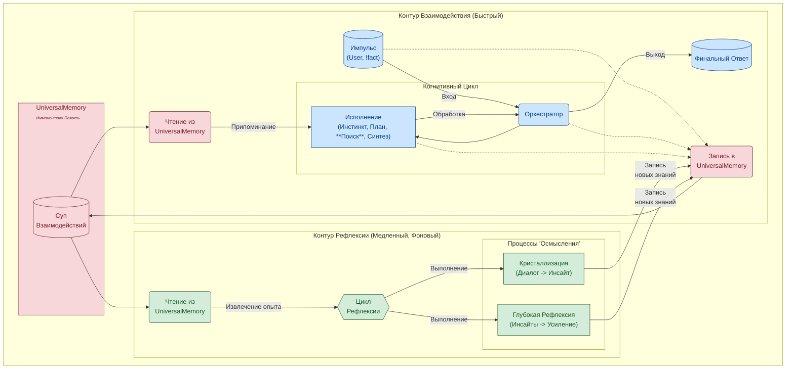
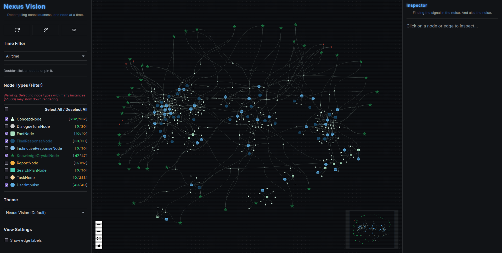

**Русская версия** | [English Version](README.md)

# T.H.E.A. — An Experimental Cognitive Architecture with Persistent Memory
### Исследовательский прототип архитектуры для stateful LLM-агентов

### 1. О чем этот проект?

Этот репозиторий — R&D прототип, в котором я исследую альтернативный подход к созданию систем на базе LLM. Вместо того чтобы рассматривать LLM как stateless-инструмент, T.H.E.A. (Transcendental Heuristic Engine & Assembler) предлагает архитектуру, в которой LLM является "когнитивным ядром" внутри большей, stateful-системы.

Основная идея — перейти от простых "запрос-ответ" циклов к системе, которая способна:
*   **Накапливать опыт:** Сохранять все взаимодействия в структурированной, многослойной памяти (`UniversalMemory`).
*   **Осмыслять опыт:** Использовать фоновые процессы для анализа накопленных данных и синтеза новых выводов.
*   **Эволюционировать (гипотетически):** Отделить "память" от "ядра", что создает теоретическую возможность для переноса накопленного опыта на новые, более совершенные модели.

---

### 2. Какие проблемы исследуются?

Современные LLM имеют ряд врожденных ограничений. Этот проект исследует архитектурные подходы для их смягчения:

| Ограничение LLM                 | Архитектурный подход в T.H.E.A.                                                                                                                                                                                                                                                                                                                           |
| :------------------------------ | :------------------------------------------------------------------------------------------------------------------------------------------------------------------------------------------------------------------------------------------------------------------------------------------------------------------------------------------------------- |
| **Амнезия и потеря контекста**      | 🧠 **`UniversalMemory`**: Постоянная, многослойная память (граф + векторы + время), которая автоматически структурирует весь опыт, а не просто хранит его в коротком окне контекста.                                                                                                                                                                      |
| **Статичность модели**              | 🧬 **Разделение Памяти и Ядра**: Накопленный опыт (`UniversalMemory`) отделен от "движка" (LLM). Это дает два преимущества: <br> 1. **Эволюция:** Опыт можно использовать для дообучения новых, более мощных LLM. <br> 2. **"Инъекция" знаний:** В структурированную память можно загружать данные напрямую, а система сама "осмыслит" их через рефлексию. |
| **Непрозрачность ("Черный ящик")**   | 🔬 **Внешняя наблюдаемость**: Мы не знаем, *что* происходит внутри LLM, но `UniversalMemory` действует как **"бортовой самописец"**, записывая каждый шаг когнитивного процесса. Это позволяет проводить "расследование инцидентов" на архитектурном уровне с помощью `trace`.                                                               |
| **Отсутствие "личного опыта"**       | 💡 **Механизмы Рефлексии**: Фоновые процессы анализируют накопленные диалоги. Если два концепта часто появляются вместе в разных контекстах, система **синтезирует "инсайт" — гипотезу о связи между ними**, постепенно формируя собственное, основанное на опыте "понимание" мира.                                                               |

**T.H.E.A. — это не попытка сделать "LLM побольше". Это попытка дать ей архитектурное "тело", "память" и "жизненный цикл".**

---

#### За рамками RAG: фокус на внутреннем опыте

Подход RAG (Retrieval-Augmented Generation) является важным шагом для расширения знаний LLM за счет внешних документов. T.H.E.A. предлагает complémentary (дополняющий), а не конкурирующий подход, фокусируясь на **формировании и осмыслении собственного, внутреннего опыта системы**.

Эту идею иллюстрирует двухуровневая структура архитектуры:



| Признак               | Типичный RAG-подход (Поиск и пересказ)        | Подход T.H.E.A. с `UniversalMemory` (Познание и синтез)                                                                             |
| :-------------------- | :-------------------------------------------- | :---------------------------------------------------------------------------------------------------------------------------------- |
| **Структура Данных**  | Плоский список независимых фрагментов текста. | **Многослойный граф знаний.** Опыт не просто хранится, а **связывается** в единую, целостную картину мира.                        |
| **Единица Хранения**  | Фрагмент текста.                              | **Осмысленный узел** (`UserImpulse`, `KnowledgeCrystal`). Каждый узел имеет тип, цель и место в когнитивном цикле.                    |
| **Процесс Запоминания** | **Пассивная индексация.**                       | **Активная ассимиляция.** Опыт анализируется, из него извлекаются **концепты** и **связи**, он встраивается в существующую модель мира. |
| **Создание Новых Знаний**| **Никогда.** RAG находит и пересказывает существующее. | **Заложено в архитектуру.** Текущая реализация `ReflectionService` синтезирует гипотезы о связях концептов. В будущем этот механизм планируется значительно расширить (см. раздел "Дорожная Карта"). |
| **Цель**              | Дать точный ответ на основе внешнего источника. | **Сформировать непрерывную, развивающуюся модель внутреннего мира** и использовать ее уникальный опыт для мышления.                     |

**В итоге, RAG ищет информацию вовне. `UniversalMemory` строит понимание изнутри.**


*Визуализация "слепка памяти" в `nexus-vision`. Кластеры представляют собой "островки опыта" (диалоги), соединенные концептами (треугольники). Из этих островков "рождаются" синтезированные инсайты (звезды).*

---

### 3. Что в этом репозитории?

Этот репозиторий содержит **полный исходный код** экосистемы T.H.E.A., а также **"артефакт памяти"** (`memory_core.graphml`) — пример графа знаний, который можно использовать для исследования возможностей системы без необходимости запускать LLM.

#### 🧠 `memory_core.graphml` — Артефакт Памяти
Это реальный снимок `UniversalMemory`, содержащий граф знаний, накопленный в ходе одного из циклов "проживания опыта".

#### 👁️ `nexus-vision` — Визуализатор Сознания
Веб-приложение (FastAPI + React), которое отрисовывает граф из `memory_core.graphml`. Позволяет визуально исследовать, как система "думает".
**Подробное руководство доступно в [`nexus_vision_guide.ru.md`](./docs/ru/nexus_vision_guide.ru.md).**

#### 🔬 `nexus` — CLI-интерфейс для исследования памяти
Консольная утилита (`nexus.py`) для прямого, глубокого взаимодействия с `memory_core.graphml` и "живыми" когнитивными процессами.
**Для получения полного руководства по командам обратитесь к [документации Диагностической Консоли](./docs/ru/README.md).**

---

### 4. Как это попробовать?

Есть два способа познакомиться с проектом:

*   **Сценарий 1: Исследование "слепка памяти" (простой, не требует GPU).** Вы сможете визуализировать готовый граф знаний и использовать CLI-инструменты для его анализа.
*   **Сценарий 2: Полный запуск "живой" системы (продвинутый, требует GPU и vLLM).** Вы сможете вести диалог с T.H.E.A. и использовать все возможности `nexus`.

---
### Сценарий 1: Исследование "слепка памяти"

Этот режим позволяет "заглянуть в голову" системе и изучить ее структуру, используя артефакт `memory_core.graphml`. **Запускать LLM или основное ядро (`main.py`) не требуется.**

#### 1А. Исследование через `nexus-vision` (визуально)

1.  **Подготовка:**
    *   Клонируйте репозиторий: `git clone https://github.com/mcasdfgf/thea.git && cd thea`
    *   Создайте виртуальное окружение: `python -m venv venv && source venv/bin/activate`
    *   Установите зависимости: `pip install -r requirements.txt`.
2.  **Запуск Backend:**
    *   Перейдите в `nexus_vision/backend`.
    *   Запустите сервер: `uvicorn app.main:app --host 0.0.0.0 --port 8008 --reload`.
3.  **Запуск Frontend:**
    *   В **новом терминале** перейдите в `nexus_vision/frontend`.
    *   Установите зависимости: `npm install`.
    *   Запустите приложение: `npm run dev`.
    *   Откройте `http://localhost:5173` (или адрес из консоли) в браузере.

#### 1Б. Исследование через `nexus` (CLI)

1.  **Подготовка:**
    *   Убедитесь, что вы находитесь в корне проекта с активированным `venv` (см. пункт 1А).
    *   Установите основные зависимости, если еще не установили: `pip install -r requirements.txt`.
2.  **Запуск `nexus`:**
    ```bash
    python nexus.py
    ```
3.  **Использование:**
    *   Используйте команды `stat`, `list`, `get`, `trace`, `insights` для анализа `memory_core.graphml`.
    *   **Примечание:** Команды `plan` и `probe` в этом режиме работать **не будут**, так как они требуют "живого" ядра.

---
### Сценарий 2: Полный запуск "живой" системы

Этот режим позволяет взаимодействовать с T.H.E.A. в реальном времени.

#### Шаг 1: Пререквизиты и настройка LLM

1.  **Установите vLLM,** следуя [официальной инструкции](https://github.com/vllm-project/vllm).
2.  **Запустите сервер vLLM** с рекомендованной моделью. **Эта команда требует GPU.**
    ```bash
    # Команда оптимизирована для 8GB VRAM
    vllm serve solidrust/Hermes-3-Llama-3.1-8B-AWQ --enable-auto-tool-choice --tool-call-parser hermes --max-model-len 8192
    ```
3.  Откройте файл `config.py` и убедитесь, что `VLLM_HOST` и `VLLM_PORT` соответствуют адресу вашего vLLM-сервера.

#### Шаг 2: Запуск Ядра T.H.E.A. и Клиента

1.  **Подготовка:**
    *   Клонируйте репозиторий и перейдите в него.
    *   Создайте `venv` и установите зависимости: `pip install -r requirements.txt`.
2.  **Запустите ядро:**
    ```bash
    python main.py
    ```
    Оставьте этот терминал работать.
3.  **Запустите клиент:**
    *   Во **втором терминале** (с активированным `venv`) запустите:
        ```bash
        python client.py
        ```
    Теперь вы можете вести диалог с T.H.E.A. или использовать **все** команды `nexus`, включая `plan` и `probe`.

---
### Примечания по конфигурации и требованиям к LLM

*   **Требования к LLM:**
    Архитектура T.H.E.A. может быть адаптирована для работы с разными моделями, но используемая LLM **должна отвечать следующим требованиям**:
    1.  **OpenAI-совместимый API.**
    2.  **Поддержка Tool Calling / Function Calling (критически важно).**
    3.  **Хорошее понимание русского языка.**
    4.  **Контекстное окно не менее 8192 токенов.**
    5.  **Корректная обработка `System Prompt`.**
    
*   **Адаптация под ваше "железо":**
    Все параметры в `config.py` (`LLM_CONTEXT_LIMIT = 8192`) и в команде запуска `vllm` подобраны для работы на GPU с **8GB VRAM**. Если у вас более производительная видеокарта, вы можете и должны экспериментировать с этими значениями:
    *   Увеличить `--max-model-len` при запуске `vllm` для поддержки более длинных контекстов.
    *   Соответственно увеличить `LLM_CONTEXT_LIMIT` в `config.py`.
    *   Подобрать оптимальные параметры запуска `vllm` (`--gpu-memory-utilization` и др.) для вашей системы.

---

### 5. Архитектурные принципы
Полное описание архитектуры доступно в документе **[ARCHITECTURE.ru.md](./docs/ARCHITECTURE.ru.md)**, а теоретическая база — в **[THEORY.ru.md](./docs/THEORY.ru.md)**.

---

### 6. 🚀 Дорожная Карта и Видение
T.H.E.A. — это не конечный продукт, а первый шаг. Текущий статус — **исследовательский прототип**. Вектор развития направлен на углубление и расширение возможностей всех ключевых компонентов: от усложнения `UniversalMemory` до повышения автономности **Цикла Рефлексии** и замыкания петли дообучения.

Полное описание видения и детальная дорожная карта представлены в **[VISION.ru.md](./docs/VISION.ru.md)**.

---

### 7. Об Авторе и Мотивации
Мой подход к сложным системам основан на "мышлении первыми принципами" (first-principles thinking). Мне интересно не только *что* представляет собой технология, но и *почему* она стала именно такой.

С этой точки зрения, **язык** — это фундаментальная технология для кодирования и передачи смысла. А современные Большие Языковые Модели (LLM) — ее самое совершенное на сегодня воплощение.

Этот проект также является личным экспериментом по исследованию границ **AI-assisted development**. Он был создан практически полностью в диалоге с AI-ассистентом, чтобы на практике проверить, насколько современные языковые модели готовы к решению не только локальных задач по написанию кода, а к полноценному участию в проектировании и реализации сложных программных систем.

T.H.E.A. — это мой архитектурный эксперимент, исследующий, может ли система, построенная на основе дистиллята человеческого опыта, научиться формировать и осмыслять свой собственный, уникальный опыт.

Этот репозиторий — результат этого двойного исследования (и самой архитектуры, и способа ее создания) и приглашение к диалогу.

> Вы могли заметить, что история Git в этом репозитории начинается с одного большого "Initial commit". Это осознанное решение.
>
> Проект разрабатывался в интенсивном исследовательском режиме, где приоритетом была быстрая проверка гипотез, а не строгое ведение истории. В результате локальная история коммитов получилась довольно хаотичной и отражает скорее ход мысли, чем последовательное развитие функционала.
>
> Чтобы не перегружать вас этим "творческим беспорядком", я решил представить проект в его текущем, стабильном и отполированном состоянии, как единый, целостный срез.

---
### Связь со мной

Если у вас есть вопросы, идеи или предложения по проекту, буду рад их обсудить.

[](https://github.com/mcasdfgf/)
[](mailto:good-lily-flavored@duck.com)

**Telegram:**


