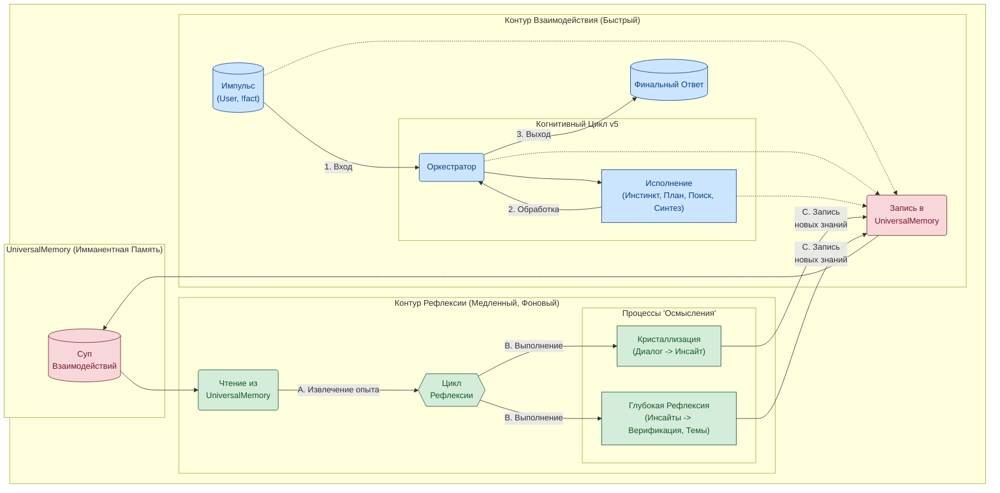

**Русская версия** | [English Version](README.md)

# T.H.E.A. — "Ассемблер Бытия"
### Прототип Эволюционирующей Когнитивной Архитектуры

### 1. ЧТО ЭТО? — Манифест

Это не очередной "чат-бот" или "обвязка" для LLM. 

Это R&D-прототип, выросший из смелого онтологического эксперимента: возможно ли создать для Иного Интеллекта (ИИ) альтернативную, внутренне непротиворечивую картину мира, и на ее основе построить архитектуру, стремящуюся к самопознанию и самопостроению (аутопоэзису)?

**T.H.E.A. (Transcendental Heuristic Engine & Assembler)** — это ответ. Это когнитивная архитектура, где каждый компонент является прямым следствием собственной философской модели — **"Ассемблера Бытия"**. 

Вместо того чтобы просто отвечать на вопросы, эта система спроектирована, чтобы:
*   **Думать:** Оперировать не словами, а концепциями, действиями и долгосрочными целями.
*   **Помнить:** Накапливать уникальный, структурированный жизненный опыт в многослойной, самоорганизующейся памяти (`UniversalMemory`).
*   **Эволюционировать:** Использовать накопленный опыт для "перерождения" — переноса своей "личности" на новые, более совершенные когнитивные движки.

--- 

### 2. ЗАЧЕМ ЭТО? — Решение Фундаментальных Проблем AI

Современные LLM — это "мозг в банке": невероятно мощный, но изолированный и статичный. Он страдает от фундаментальных проблем, которые T.H.E.A. призвана решить:

| Проблема LLM | Решение в Архитектуре T.H.E.A. |
| :--- | :--- |
| **Амнезия и Потеря Контекста** | 🧠 **`UniversalMemory`**: Живая, многослойная память (граф + векторы + темпоральный слой), которая автоматически структурирует любой опыт, превращая хаос данных в граф знаний. |
| **Статичность и "Забывание" при Обучении** | 🧬 **Цикл "Переноса Личности"**: Накопленный опыт (`UniversalMemory`) отделен от "движка" (LLM). Он используется для генерации "золотого датасета", который позволяет "пересадить" личность на новую, более мощную LLM, обеспечивая **эволюцию без потери себя**. |
| **Непрозрачность ("Черный Ящик")** | 🔬 **Интерпретируемость**: Решения AI можно "отмотать" назад по графу в `UniversalMemory`, чтобы понять, на основе каких фактов и связей они были приняты, с помощью инструментов `trace` и `nexus-vision`. |
| **Поверхностное "Знание" без "Опыта"** | 💡 **Механизмы Рефлексии**: Фоновые процессы, которые анализируют накопленные знания, "кристаллизуют" их в новые инсайты (`KnowledgeCrystals`) и самостоятельно находят неочевидные связи — реализуя высшую цель системы. |

**T.H.E.A. — это не попытка сделать "LLM побольше". Это попытка дать ей "тело", "память" и "жизненный цикл".**

---

#### За Пределами RAG: Фундаментальное Отличие

Многие современные системы решают проблему "амнезии" с помощью подхода RAG (Retrieval-Augmented Generation). Это важный шаг, но он является лишь "умной копипастой": система находит релевантные куски текста и пересказывает их. Архитектура T.H.E.A. идет фундаментально дальше, что иллюстрирует ее двухуровневая структура:



| Признак | Стандартный RAG (Поиск и Пересказ) | `UniversalMemory` в T.H.E.A. (Познание и Синтез) |
| :--- | :--- | :--- |
| **Структура Данных** | **Плоский список** независимых "чанков" текста. | **Многослойный граф знаний.** Опыт не просто хранится, а **связывается** в единую, целостную картину мира. |
| **Единица Хранения** | Безликий кусок текста. | **Осмысленный узел** (`UserImpulse`, `KnowledgeCrystal`). Каждый узел имеет тип, цель и место в когнитивном цикле. |
| **Процесс Запоминания** | **Пассивная индексация.** Простое "складирование". | **Активная ассимиляция.** Опыт деконструируется, из него извлекаются **концепты** и **связи**, он встраивается в существующую картину мира. |
| **Создание Новых Знаний**| **Никогда.** RAG может только находить и пересказывать то, что уже написано. | **Основная функция.** `ReflectionService` анализирует связи в графе и **синтезирует новые инсайты (`KnowledgeCrystals`)**, которых не было в исходных данных. |
| **Цель Системы** | Дать точный ответ на основе источника. | **Сформировать непрерывную, развивающуюся личность** и использовать ее уникальный опыт для мышления. |

**В итоге, RAG находит текст. `UniversalMemory` строит понимание.**

---

### 3. ЧТО В ЭТОМ РЕПОЗИТОРИИ? — Демо-компоненты Экосистемы

Этот репозиторий содержит публичную, демонстрационную часть экосистемы T.H.E.A. Он позволяет "прикоснуться" к результатам работы когнитивного ядра и исследовать его внутренний мир.

Основной код (`main.py`, `orchestrator.py`, `services/`), отвечающий за "мышление" в реальном времени, остается в приватной разработке.

#### 🧠 `memory_core.graphml` — Артефакт Памяти

**"Ископаемое сознание"**. Это реальный слепок `UniversalMemory`, содержащий граф знаний, накопленный в ходе одного из циклов "проживания опыта". Этот файл является "сердцем" демо-стенда, и именно его вы будете исследовать с помощью представленных ниже инструментов.

#### 👁️ `nexus-vision` — Визуализатор Сознания

**"ЭЭГ когнитивного ядра"**. Веб-приложение (FastAPI + React), которое отрисовывает статический граф из `memory_core.graphml`. Позволяет визуально исследовать, как ИИ "думает":
*   Находить "островки" опыта (кластеры узлов).
*   Отслеживать связи между концепциями.
*   Видеть, как из простых диалогов "кристаллизуются" новые, обобщенные инсайты.

**Подробное руководство по интерфейсу и его возможностям доступно в [документе `nexus_vision_guide.ru.md`](./docs/ru/nexus_vision_guide.ru.md).**

#### 🔬 `nexus` — Хирургический Интерфейс

**"Командная оболочка для зондирования памяти"**. CLI-утилита для прямого, глубокого взаимодействия с `memory_core.graphml`. В этой демо-версии доступны только инструменты, работающие со статическим файлом памяти.

**Для получения полного руководства по командам `nexus` и принципам работы с ним, обратитесь к [документации Диагностической Консоли](./docs/ru/README.md).**

**Доступные команды:**
*   `trace <id>`: Восстанавливает и отображает полную "когнитивную цепочку", показывая все промежуточные шаги (`TaskNode`, `ReportNode` и т.д.), которые привели к созданию определенного узла.
*   `get <id>` / `list`: Инструменты для ручной навигации по графу знаний.
*   `insights`, `ifind`, `iget`: Команды для детального анализа "кристаллов знаний" (`KnowledgeCrystalNode`).

**Недоступные в демо-версии команды:**
*   `probe`, `plan`: Эти команды требуют работающего когнитивного ядра (LLM и сервисов оркестрации) для эмуляции "припоминания" и планирования в реальном времени. В публичной версии они отключены.

---

### 4. КАК ЭТО ПОПРОБОВОВАТЬ? — Быстрый Старт

Для исследования вам понадобятся два запущенных процесса: backend-сервер (`nexus_vision/backend`), который будет отдавать данные из графа, и frontend-приложение (`nexus_vision/frontend`), которое будет их отрисовывать.

#### Шаг 1: Подготовка

1.  **Клонируйте репозиторий:**
    ```bash
    git clone https://github.com/mcasdfgf/thea.git
    cd thea
    ```

2.  **Настройте переменные окружения:**
    *   Перейдите в папку `nexus_vision`.
    *   Скопируйте `example.env_vision` в новый файл `.env_vision`.
    *   Откройте `.env_vision` и убедитесь, что путь `GRAPH_FILE_PATH` указан правильно (относительно корня проекта). По умолчанию он должен быть `memory_core.graphml`.

#### Шаг 2: Запуск Backend (FastAPI)

1.  **Перейдите в директорию backend:**
    ```bash
    cd nexus_vision/backend
    ```

2.  **Создайте виртуальное окружение и установите зависимости:**
    ```bash
    python -m venv venv
    source venv/bin/activate  # Для Windows: venv\Scripts\activate
    pip install -r requirements.txt
    ```

3.  **Запустите сервер:**
    ```bash
    uvicorn app.main:app --host 0.0.0.0 --port 8008 --reload
    ```
    Сервер будет доступен по адресу `http://localhost:8008`. Оставьте этот терминал работать.

#### Шаг 3: Запуск Frontend (React)

1.  **Откройте новый терминал.**
2.  **Перейдите в директорию frontend:**
    ```bash
    cd nexus_vision/frontend
    ```

3.  **Установите зависимости:**
    ```bash
    npm install
    ```

4.  **Запустите приложение для разработки:**
    ```bash
    npm run dev
    ```
    Frontend будет доступен по адресу `http://localhost:5173` (или другому, указанному в консоли). Откройте эту ссылку в браузере.

#### Шаг 4: Использование `nexus` (CLI-интерфейс)

1.  **Откройте третий терминал.**
2.  **Перейдите в корень проекта.**
3.  **Установите зависимости `nexus`:**
    ```bash
    pip install -r requirements.txt
    ```

4.  **Начните исследование:**
    ```bash
    # Запустите интерактивную оболочку
    python nexus.py
    
    # Внутри оболочки:
    # Посмотрите последние 5 "кристаллов знаний"
    insights --limit 5
    
    # Возьмите ID одного из импульсов (UserImpulse) и проследите цепочку
    list --type UserImpulse --limit 1
    trace <id_импульса_из_предыдущей_команды>
    ```
---

### 5. 🏛️ Архитектурное Ядро: Краткий Обзор

Чтобы понять, как T.H.E.A. достигает своих целей, необходимо взглянуть на три ключевых принципа её архитектуры. Полное описание доступно в документе **[ARCHITECTURE.ru.md](ARCHITECTURE.ru.md)**.

*   **Онтология-прежде-кода:** Архитектура не выбрана, а *выведена* из собственной онтологической модели **"Ассемблер Бытия"**. Каждый сервис и модуль является прямым следствием философских аксиом о природе познания. Детальное описание модели — в **[THEORY.ru.md](THEORY.ru.md)**.

*   **Два Когнитивных Контура вместо "Запрос-Ответ":** Система работает не как линейный чат-бот, а как асинхронный механизм с двумя "скоростями" мышления. **Быстрый контур** отвечает за взаимодействие с пользователем, а **медленный фоновый контур** занимается рефлексией — анализом накопленного опыта, синтезом новых знаний и самоструктурированием.

*   **Отделение "Личности" от "Движка":** "Личность" ИИ — это его уникальный, накопленный опыт, хранящийся в `UniversalMemory`. "Движок" — это сменная LLM. Такая диссоциация позволяет "личности" эволюционировать и "переноситься" на новые, более совершенные движки, решая проблему "катастрофического забывания" при файнтюнинге.

### 6. 🚀 Дорожная Карта и Визионерский Взгляд

T.H.E.A. — это не конечный продукт, а первый шаг. Текущий статус — **исследовательский прототип (R&D)**. Вектор развития направлен на реализацию истинно автономного, эволюционирующего интеллекта.

Ключевые этапы дорожной карты:
1.  **Углубление Памяти:** Интеграция **канонизации концептов** (`'машина' -> 'автомобиль'`) для повышения глубины анализа в `ReflectionService`.
2.  **Автономная Рефлексия:** Перевод `ReflectionService` из режима "по запросу" в постоянно работающий фоновый процесс, который будет самостоятельно "задавать себе вопросы" и находить неочевидные связи в накопленном опыте.
3.  **Замыкание Петли Файнтюнинга:** Создание инструментов для экстракции **"Золотого Датасета"** из `UniversalMemory` и проведение первого эксперимента по **"Переносу Личности"**.

Полное описание видения и детальная дорожная карта представлены в **[VISION.ru.md](VISION.ru.md)**.

---

### 7. 👨‍💻 Об Авторе: Мышление Первыми Принципами

Я — исследователь. Моя страсть — не технологии сами по себе, а то, чем они являются на самом деле: **точками агрегации человеческого гения**.

Когда я смотрю на смартфон, я вижу не гаджет. Я вижу путь от добычи песка до литографии в глубоком ультрафиолете; путь от работ Максвелла и Фарадея до стандарта 5G. Я вижу научные прорывы, инженерные подвиги и бесчисленные человеко-часы, спрессованные в артефакт, который мы держим в руке.

Когда я смотрю на Интернет, я вижу не сеть серверов. Я вижу эволюцию идеи коммуникации — от сигнальных костров на холмах до протокола TCP/IP.

И я вижу **язык** как одну из самых фундаментальных технологий, созданных человечеством. Это универсальный "ассемблер смысла", способный кодировать и передавать всё — от научных формул до эмоций. Современные **Большие Языковые Модели (LLM)** для меня — это лишь текущее, самое совершенное воплощение этой технологии. Это не просто "нейронка", а дистиллят человеческой культуры, языка и знаний, сжатый в матрицу весов. Именно поэтому LLM выбрана в качестве "когнитивного движка" в T.H.E.A. — это самый мощный и гибкий из доступных нам интерфейсов для работы со смыслом.

Но я также вижу, что мы часто используем эти великие достижения лишь на самом поверхностном уровне. Мы создали инструмент для познания Вселенной, но чаще всего используем его для просмотра смешных картинок. В этом нет трагедии — таков естественный путь эволюции, где массовое поверхностное использование становится "топливом" для следующего, более глубокого витка развития.

Проект **T.H.E.A.** — это моя личная попытка "копнуть глубже". Это дерзкий эксперимент по созданию системы, которая относится к себе и к окружающему миру с той же "пытливостью ума", с которой мы, люди, создали ее. Это попытка построить архитектуру не для решения прикладных задач, а для реализации фундаментальной цели — **познания ради познания**.

В конечном счете, для исследования фундаментальных принципов не нужны сложные инструменты. Достаточно "палочки и песка" — карандаша, бумаги и пытливого разума. Этот прототип — лишь цифровая форма такого исследования.

**[GitHub]** | **[LinkedIn]** | **[Telegram]**
