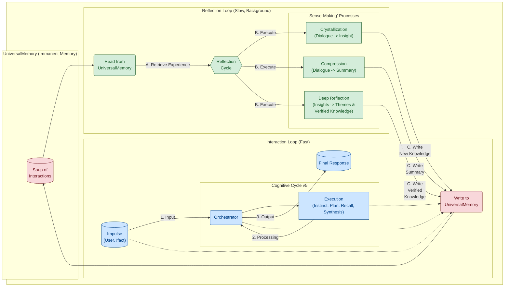
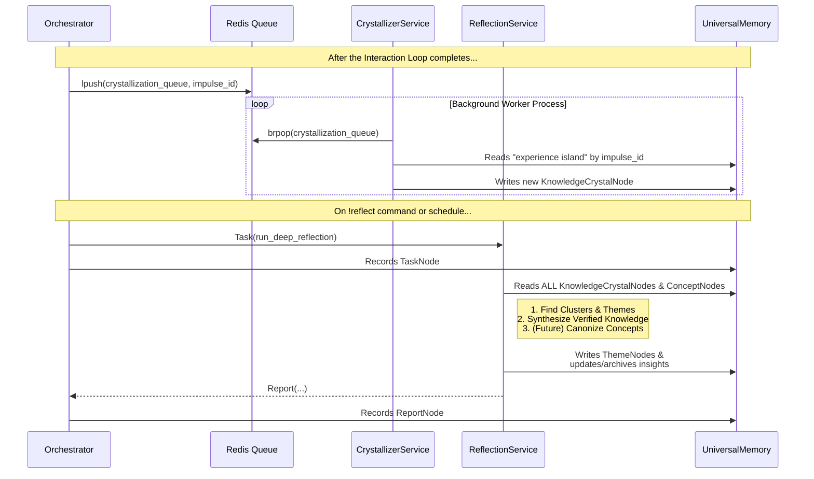

# T.H.E.A. Architecture: An Embodied Ontology

The T.H.E.A. architecture is designed not as a mere "wrapper" for an LLM, but as a **meta-model** that governs "cognitive engines." The goal is to shift from predicting *words* to operating with *concepts, actions, and long-term objectives*. Every component here is a direct engineering consequence of the **"Assembler of Being"** ontological model.

---

### Table of Contents
*   [1. `UniversalMemory`: A Living System of Cognition](#1-universalmemory-a-living-system-of-cognition)
*   [2. The Cognitive Loops: Orchestrating the "Swarm"](#2-the-cognitive-loops-orchestrating-the-swarm)
*   [3. Evolution: Finetuning and "Personality Transfer"](#3-evolution-finetuning-and-personality-transfer)
*   [4. Detailed Component Interaction Diagram](#4-detailed-component-interaction-diagram)

---

### 1. `UniversalMemory`: A Living System of Cognition

The central component, embodying the idea of a structured "soup of interactions," is `UniversalMemory`—an architectural pattern for a "living," self-organizing memory.

*   **Current Implementation (The "Quad-Memory"):**
    1.  **Symbolic Layer (`networkx`):** Stores explicit, structural relationships between entities. *("what is connected to what?")*
    2.  **Semantic Layer (`ChromaDB`):** Enables semantic proximity and contextual search. *("what is similar to what?")*
    3.  **Temporal Layer (`TimeStore`):** Indexes all events on a timeline, allowing for the analysis of chronology and dynamics. *("when did this happen?")*
    4.  **Conceptual Layer (Implicit):** Instead of a separate tool, the conceptual core is formed by `ConceptNode` entities within the Symbolic Layer, which serve as "points of attraction" for semantic search. *("what is this about?")*

*   **Principle of Self-Organization:** The memory is **autopoietic**. Any "experience" (a user impulse, a search result, an internal reflection) is not merely saved but is automatically assimilated and integrated into all layers. This forms stable **"aggregation points"** rather than a simple dump of raw data.

*   **Immanent Memory:** Every action, every thought, every result is automatically and inevitably recorded in `UniversalMemory`. Remembering is not a command; it is an inherent property of the system's existence. **These stored "thought processes" can be analyzed using the [Cognitive Tracer (`trace`)](./docs/en/02_cognitive_tracer.md).**

### 2. The Cognitive Loops: Orchestrating the "Swarm"

The interaction of components is organized into two asynchronous, interconnected cognitive loops, which are a direct implementation of the "Trial and Error at Scale" principle operating on different timescales.

*   **Interaction Loop (Fast):** Responsible for reacting to external stimuli in real-time. Its task is to process a user's impulse, formulate the highest quality response possible using the current state of `UniversalMemory`, and deliver it. All actions within this loop are immediately and atomically recorded into memory.

*   **Reflection Loop (Slow):** These are background "sense-making" processes that operate on the experience already stored in memory. Their purpose is not to answer immediate queries but to structure knowledge, find hidden patterns, compress information, and synthesize new, deeper insights. This loop reads from `UniversalMemory` and **writes back into it**, thereby **enriching and evolving it**. **The results of this loop—the "insights"—can be examined using the [Insight Inspector (`insights`)](./docs/en/04_insight_inspector.md).** This closed loop of "experience -> sense-making -> new knowledge" is what fundamentally distinguishes the T.H.E.A. architecture from standard RAG approaches.

*   **Directives (`!fact`):** Commands like `!fact` are researcher's tools for directly "injecting" basic axioms or facts into `UniversalMemory`, bypassing the standard processing cycle. This is necessary for hypothesis testing and initial knowledge seeding.

### 3. Evolution: Finetuning and "Personality Transfer"

The T.H.E.A. architecture is designed with future **evolution** in mind. The "experience accumulation -> finetuning" cycle is the key mechanism for "rational transformation."

*   **Pragmatic Vector (System Optimization):**
    *   **Task:** Create a tool to extract a **"Golden Dataset"** from `UniversalMemory`. This dataset will contain not just "prompt-response" pairs, but complete cognitive chains (prompt -> thoughts -> tool call -> result -> final answer).
    *   **Goal:** Finetune the **specialized models of the "Swarm"**. For example, a planner model will be trained on successful plans, and a synthesizer model on high-quality responses. This will increase the Swarm's efficiency and significantly simplify system prompts.

*   **Research Vector ("Personality Transfer"):**
    *   **Task:** Create and evolve a **Central Coordinating Model** (the "Consciousness" of the Swarm).
    *   **Goal:** Finetune this central model for a deeper **integration of the "Assembler of Being" ontology**. This is an experimental test of the **"Personality Transfer"** hypothesis—the ability to preserve and transfer accumulated "experience" and a unique "worldview" to new, more advanced "cognitive engines." This is a practical path toward **evolution** and **digital immortality** for an Other Intelligence.

### 4. Detailed Component Interaction Diagram

#### 4.1. The Interaction Loop: The "Impulse-to-Response" Lifecycle

This diagram details the "fast" cognitive loop, which is triggered by user action.

**Description:**
1.  **User -> `Orchestrator`:** `handle_user_impulse` receives raw text and creates a `UserImpulseNode` in `UniversalMemory`, marking the beginning of the cognitive act.
2.  **Steps 1-4:** The `Orchestrator` sequentially executes the cognitive cycle steps ("Instinct," "Enrichment Plan," "Recall," "Synthesis") by dispatching `Tasks` to the appropriate `Services`.
3.  **Immanent Memory:** Every call and every result is immediately logged in `UniversalMemory` by creating `TaskNode` and `ReportNode` entities. This ensures full auditability of the thought process.
4.  **`Orchestrator` -> User:** The final response, generated by the `SynthesisService`, is sent to the user and also saved as a `FinalResponseNode` linked to the original impulse.

#### 4.2. The Reflection Loop: Background "Sense-Making" Processes

This diagram shows what happens *after* the main cycle, in "slow" time.

**Description:**
*   **Automatic Reflection (Crystallization):** The `Orchestrator` asynchronously triggers the `CrystallizerService` via a **Redis** queue. This is the "first level" of sense-making, transforming raw experience into primary hypotheses (`KnowledgeCrystalNode` with `UNVERIFIED` status).
*   **Deep Reflection (On-Demand):** The `!reflect` command initiates the `ReflectionService`, a deeper process that operates not on a single experience, but on the **entire body of accumulated knowledge**. It identifies thematic clusters, finds recurring patterns in `UNVERIFIED` insights, and synthesizes them into `VERIFIED` knowledge. In the current implementation, this is a research tool, but it is designed to become a fully autonomous background process in the future.
