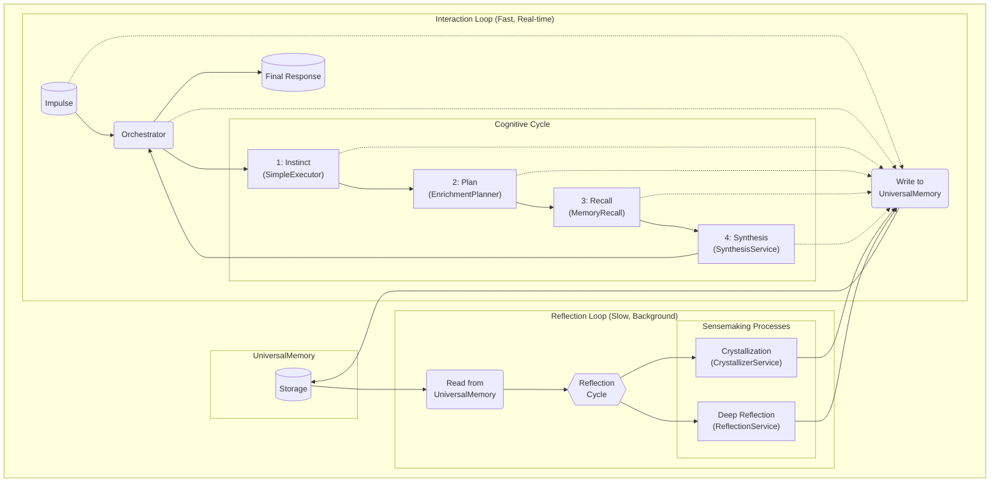
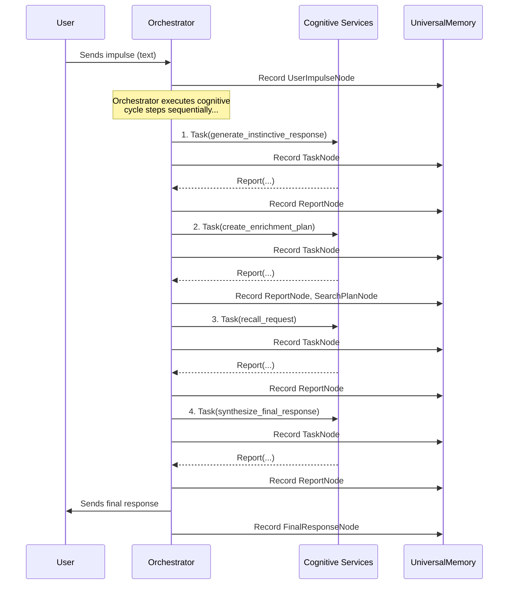
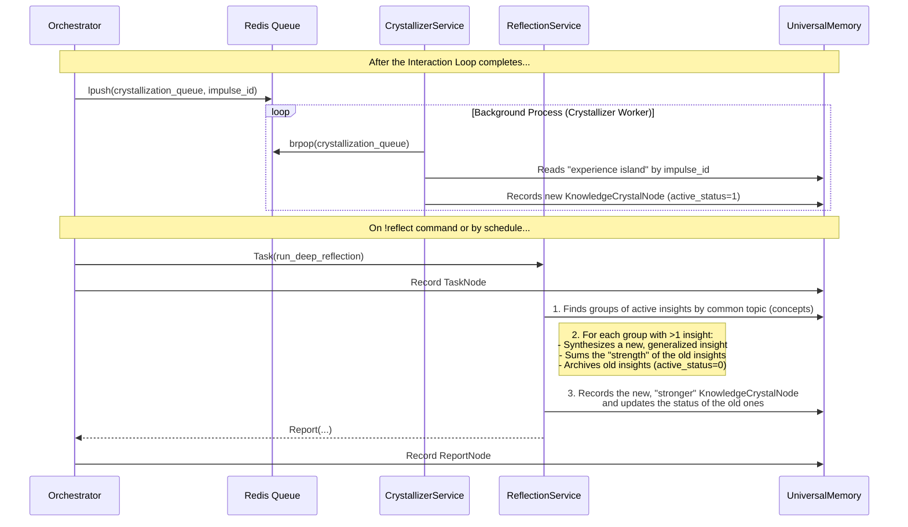

# T.H.E.A. Architecture

The T.H.E.A. architecture is an attempt to build a stateful system around an LLM. Instead of being a simple "wrapper," it creates an environment where the LLM serves as a swappable "cognitive core." The key objective is to build a system that not only handles immediate requests but also accumulates structured experience for subsequent reflection. Each component is a practical implementation of the ideas outlined in **[THEORY.md](./THEORY.md)**.

*Note: T.H.E.A. is an active R&D project. The architecture described here reflects its current state. Some components may and will be changed, rethought, and improved in the course of further research.*

---

### Table of Contents
*   [1. `UniversalMemory`: A Multi-Layered Memory System](#1-universalmemory-a-multi-layered-memory-system)
*   [2. Cognitive Loops: Two Paces of "Thinking"](#2-cognitive-loops-two-paces-of-thinking)
*   [3. Evolution: Closing the Fine-tuning Loop](#3-evolution-closing-the-fine-tuning-loop)
*   [4. Detailed Interaction Schemas](#4-detailed-interaction-schemas)

---

### 1. `UniversalMemory`: A Multi-Layered Memory System

The central component of the system is `UniversalMemory`, an architectural pattern for a self-organizing, persistent memory.

*   **Current Implementation ("Quad-Memory"):**
    1.  **Symbolic Layer (`networkx`):** A graph database that stores explicit, structural relationships between entities. *("What is connected to what?")*
    2.  **Semantic Layer (`ChromaDB`):** A vector database that enables search by semantic similarity. *("What is similar to what?")*
    3.  **Temporal Layer (JSON file):** A chronological log of all events, indexed on a timeline. *("When did this happen?")*
    4.  **Conceptual Layer (Graph-native):** This layer is not a separate database. It is formed *within* the Symbolic Layer as special nodes (`ConceptNode`). These nodes act as semantic "anchors" or "tags" that link disparate pieces of experience by their shared meaning. *("What is this about?")*

*   **Self-Organization Principle:** Any "experience" (a user impulse, a search result, an internal reflection) is not merely saved but is automatically assimilated and integrated across all layers. This allows the system to form robust connections between data over time, rather than just accumulating it.

*   **Inherent Logging:** Every action, every task, and every result is automatically recorded in `UniversalMemory`. Memorization is not a command but a fundamental principle of the system's operation. These stored "thought processes" can be analyzed using the [Cognitive Tracer (`trace`)](./en/02_cognitive_tracer.md).

### 2. Cognitive Loops: Two Paces of "Thinking"

The interaction between components is organized into two asynchronous, interconnected cognitive loops that operate on different time scales.

*   **Interaction Loop (Fast):** Responds to external stimuli in real-time. Its job is to process a user's impulse and generate the highest quality response possible using the current state of `UniversalMemory`. All actions in this loop are immediately logged to memory.

*   **Reflection Loop (Slow):** Consists of background "sensemaking" processes that operate on the accumulated experience in memory. Their purpose is not to answer immediate requests but to structure knowledge, find hidden patterns, and synthesize new, deeper insights. This loop reads from `UniversalMemory` and **writes back to it**, thereby **enriching and evolving it**. The results of this loop—the "insights"—can be explored using the [Knowledge Inspector (`insights`)](./en/04_insight_inspector.md).

#### Short-Term Memory Management (Context Window)
To maintain conversational coherence, the system uses a cache of recent messages that is passed to the LLM. To prevent overflowing the model's context window, a **"Smart FIFO"** mechanism is implemented:
1.  Before processing a new request, the system estimates whether the combined size of the cache and the new message will exceed a set threshold (e.g., 70% of the LLM's limit).
2.  If the threshold is exceeded, the oldest message pair ("question-answer") is pushed out of the cache.
3.  This "evicted" pair is not simply discarded; it is sent to a background **distillation** task (`MemoryCompressorService`), where it is compressed into a concise summary and archived in `UniversalMemory` as a `DialogueTurnNode`.
This allows the system to handle long conversations without losing context, while simultaneously enriching its long-term memory with distilled experience.

---
### 3. Evolution: Closing the Fine-tuning Loop

The T.H.E.A. architecture is designed with future **evolution** in mind. The separation of "memory" (`UniversalMemory`) from the "core" (LLM) is a key mechanism for this. The "experience accumulation -> fine-tuning" cycle serves two purposes:

*   **Pragmatic Vector (System Optimization):**
    *   **Task:** To create a tool for extracting a **"Golden Dataset"** from `UniversalMemory`. This dataset would contain not just "question-answer" pairs, but complete cognitive chains (e.g., `impulse -> generated_plan -> recall_result -> final_synthesis`).
    *   **Goal:** To fine-tune **specialized models in a "Swarm"** (if the architecture evolves to be swarm-based) or a single central model. The core idea is to **teach the LLM to use its "body" more effectively**:
        *   A planner model would be fine-tuned on successful plans to generate more precise and concise search queries.
        *   A synthesizer model would learn to better utilize the search results from `UniversalMemory`.
    *   **Outcome:** This could significantly **simplify system prompts**, transferring some instructions from the prompt text directly into the model's "behavior," embedded in its weights.

*   **Research Vector ("Personality Transfer"):**
    *   **Task:** To use the accumulated unique experience (insights, distilled dialogues) for fine-tuning.
    *   **Goal:** To test the hypothesis of **"Personality Transfer"**—the ability to preserve and transfer not just facts, but a unique "worldview" and reasoning style to new, more advanced "cognitive cores" (LLMs). This provides a practical path to solving the **"catastrophic forgetting"** problem and enabling continuous **evolution** for the system.

---
### 4. Detailed Interaction Schemas

#### 4.1. Interaction Loop: The "Impulse-Response" Lifecycle

This diagram details the "fast" cognitive loop triggered by a user action.

**Text Description:**
1.  **User -> Orchestrator:** The `handle_user_impulse` function receives raw text and creates a `UserImpulseNode` in `UniversalMemory`.
2.  **Steps 1-4:** The `Orchestrator` sequentially executes the steps of the cognitive cycle ("Instinct," "Enrichment Plan," "Recall," "Synthesis") by dispatching `Tasks` to the appropriate `Services`.
3.  **Inherent Logging:** Every call and every result is immediately logged in `UniversalMemory` by creating `TaskNode`s and `ReportNode`s. This ensures full auditability of the thought process.
4.  **Orchestrator -> User:** The final response generated by the `SynthesisService` is sent to the user and also saved as a `FinalResponseNode`, linked to the original impulse.

#### 4.2. Reflection Loop: Background "Sensemaking" Processes

This diagram shows what happens *after* the main interaction loop, in "slow" time.

**Text Description:**
*   **Automatic Crystallization (Level 1):** After each dialogue, the `Orchestrator` asynchronously triggers the `CrystallizerService` via Redis. This service performs "primary sensemaking": it analyzes the dialogue, finds connections between concepts, and creates **new, "weak" insights** (`KnowledgeCrystalNode` with `active_status=1` and `strength=1`).
*   **Deep Reflection (Level 2, On-demand):** The `!reflect` command starts the `ReflectionService`. This is a deeper process that operates not on a single experience, but on the **entire mass of accumulated active insights**. It looks for insights related to the same topic (a pair of concepts) and, if it finds several, it **merges them**: it creates one new, generalized, and "stronger" insight (with summed `strength`), and "archives" the old ones (sets `active_status=0`). This "create -> accumulate -> merge" cycle is the mechanism for knowledge evolution in the system.
