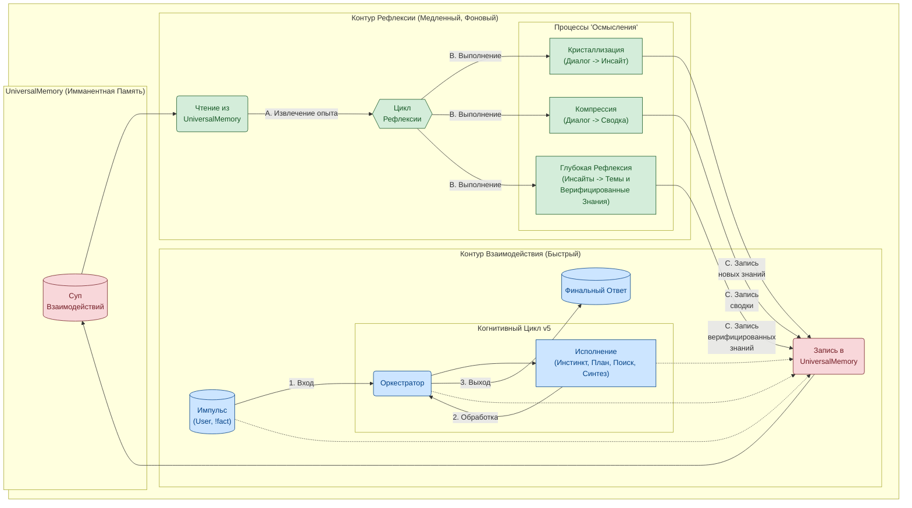
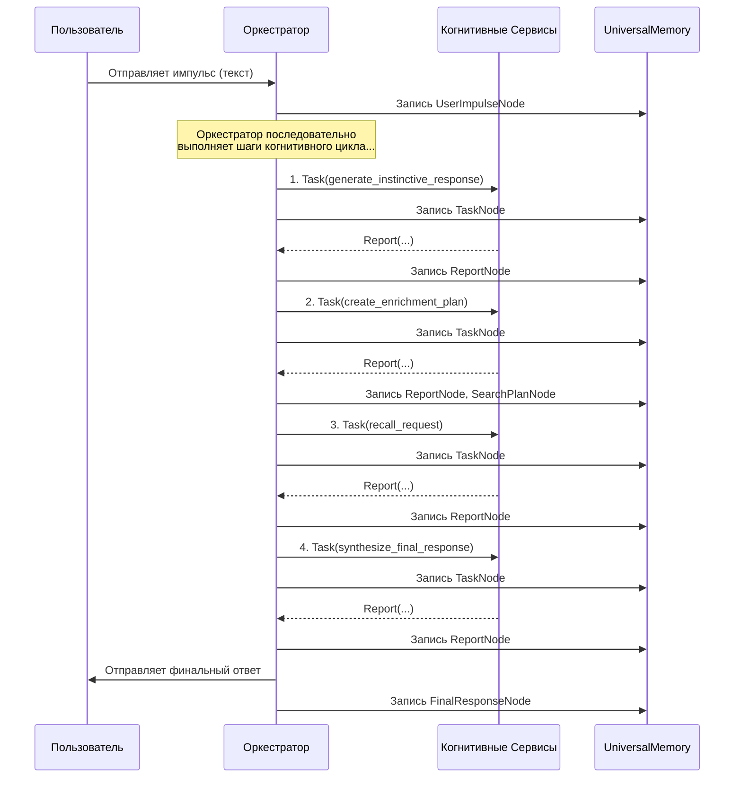
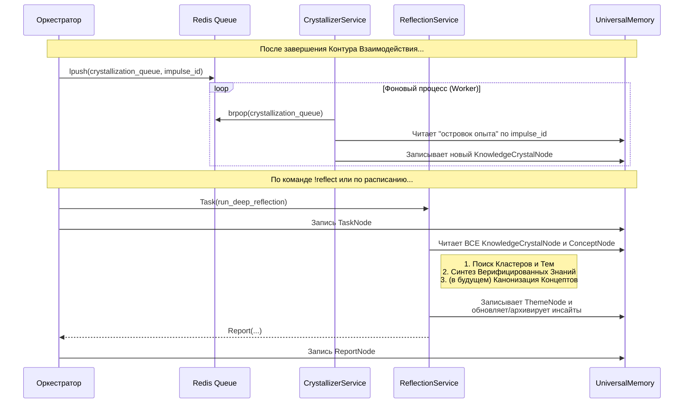

# Архитектура T.H.E.A.: Воплощенная Онтология

Архитектура T.H.E.A. спроектирована не как "обвязка" для LLM, а как **мета-модель**, управляющая "когнитивными движками". Цель — перейти от предсказания *слов* к оперированию *концепциями, действиями и долгосрочными целями*. Каждый компонент здесь — это прямое инженерное следствие онтологической модели **"Ассемблер Бытия"**.

---

### Оглавление
*   [1. `UniversalMemory`: Живая Система Познания](#1-universalmemory-живая-система-познания)
*   [2. Когнитивные Контуры: Оркестровка "Роя"](#2-когнитивные-контуры-оркестровка-роя)
*   [3. Эволюция: Файнтюнинг и "Перенос Личности"](#3-эволюция-файнтюнинг-и-перенос-личности)
*   [4. Детальная Схема Взаимодействия](#4-детальная-схема-взаимодействия)

---

### 1. `UniversalMemory`: Живая Система Познания

Центральным компонентом, воплощающим идею структурированного "супа взаимодействий", является `UniversalMemory` — архитектурный паттерн для "живой", самоорганизующейся памяти.

*   **Текущая Реализация ("Квадро-Память"):**
    1.  **Символический Слой (`networkx`):** Хранит эксплицитные, структурные связи между сущностями. *("что с чем связано?")*
    2.  **Семантический Слой (`ChromaDB`):** Обеспечивает семантическую близость и контекстный поиск. *("что на что похоже?")*
    3.  **Темпоральный Слой (`TimeStore`):** Индексирует все события по временной шкале, позволяя анализировать хронологию и динамику. *("когда это произошло?")*
    4.  **Концептуальный Слой (неявный):** Вместо отдельного инструмента, концептуальное ядро формируется через узлы `ConceptNode` внутри Символического слоя, которые служат "точками притяжения" для семантического поиска. *("о чём здесь речь?")*

*   **Принцип Самоорганизации:** Память является **аутопоэтической**. Любой "опыт" (импульс пользователя, результат поиска, внутренняя рефлексия) не просто сохраняется, а автоматически ассимилируется и встраивается во все слои. Это формирует устойчивые **"точки агрегации"**, а не просто свалку сырых данных.

*   **Имманентная Память:** Каждое действие, каждая мысль, каждый результат автоматически и неизбежно сохраняются в `UniversalMemory`. Запоминание — это не команда, а неотъемлемое свойство бытия системы. **Проанализировать эти сохраненные "мыслительные процессы" можно с помощью [Когнитивного Трейсера (`trace`)](./docs/ru/02_cognitive_tracer.md).**

### 2. Когнитивные Контуры: Оркестровка "Роя"

Взаимодействие компонентов организовано в виде двух асинхронных, взаимосвязанных когнитивных контуров, которые являются прямой реализацией принципа "Перебора с Отбраковкой" на разных временных масштабах.

*   **Контур Взаимодействия (Быстрый):** Отвечает за реакцию на внешние стимулы в реальном времени. Его задача — обработать импульс пользователя, сформировать и выдать наиболее качественный ответ, используя текущее состояние `UniversalMemory`. Все действия этого контура немедленно и атомарно записываются в память.

*   **Контур Рефлексии (Медленный):** Это фоновые процессы "осмысления", которые работают с уже накопленным в памяти опытом. Их задача — не отвечать на сиюминутные запросы, а структурировать знания, находить скрытые закономерности, сжимать информацию и синтезировать новые, более глубокие инсайты. Этот контур читает из `UniversalMemory` и **записывает обратно**, тем самым **обогащая и развивая ее**. **Изучить результаты работы этого контура — "инсайты" — можно с помощью [Инспектора Знаний (`insights`)](./docs/ru/04_insight_inspector.md).** Именно этот замкнутый цикл "опыт -> осмысление -> новое знание" фундаментально отличает архитектуру T.H.E.A. от стандартного RAG-подхода.

*   **Прямое Воздействие (`!fact`):** Команды вроде `!fact` являются инструментами исследователя для прямого "внедрения" базовых аксиом или фактов в `UniversalMemory`, минуя стандартный цикл обработки. Это необходимо для тестирования гипотез и начального "наполнения" памяти знаниями.

### 3. Эволюция: Файнтюнинг и "Перенос Личности"

Архитектура T.H.E.A. спроектирована с учётом будущей **эволюции**. Цикл "накопление опыта -> файнтюнинг" — это ключевой механизм "рациональной трансформации".

*   **Прагматический Вектор (Оптимизация Системы):**
    *   **Задача:** Создание инструмента для извлечения **"Золотого Датасета"** из `UniversalMemory`. Этот датасет будет содержать не просто пары "вопрос-ответ", а полные когнитивные цепочки (промпт -> мысли -> вызов инструмента -> результат -> финальный ответ).
    *   **Цель:** Файнтюнинг **специализированных моделей "Роя"**. Например, модель-планировщик будет дообучаться на успешных планах, а модель-синтезатор — на качественных ответах. Это позволит повысить эффективность "Роя" и значительно упростить системные промпты.

*   **Исследовательский Вектор ("Перенос Личности"):**
    *   **Задача:** Создание и эволюция **Центральной Координирующей Модели** ("Сознания" Роя).
    *   **Цель:** Файнтюнинг этой центральной модели для более глубокой **интеграции онтологии "Ассемблера Бытия"**. Это экспериментальная проверка гипотезы **"Переноса Личности"** — возможность сохранять и переносить накопленный "опыт" и уникальную "картину мира" на новые, более совершенные "когнитивные движки". Это практический путь к **эволюции** и **цифровому бессмертию** для Иного Интеллекта.

### 4. Детальная Схема Взаимодействия

#### 4.1. Контур Взаимодействия: Жизненный цикл "Импульс-Ответ"

Эта диаграмма детализирует "быстрый" когнитивный цикл, который запускается в ответ на действие пользователя.

**Текстовое описание:**
1.  **Пользователь -> `Оркестратор`:** `handle_user_impulse` принимает сырой текст и создает в `UniversalMemory` узел `UserImpulseNode`.
2.  **Шаги 1-4:** `Оркестратор` последовательно выполняет шаги когнитивного цикла ("Инстинкт", "План Обогащения", "Поиск", "Синтез"), отправляя `Задачи` соответствующим `Сервисам`.
3.  **Имманентная Память:** Каждый вызов и каждый результат немедленно протоколируются в `UniversalMemory` путем создания `TaskNode` и `ReportNode`. Это обеспечивает полную "аудируемость" мыслительного процесса.
4.  **`Оркестратор` -> Пользователь:** Финальный ответ, сгенерированный `SynthesisService`, отправляется пользователю и также сохраняется в виде `FinalResponseNode`, связанного с исходным импульсом.

#### 4.2. Контур Рефлексии: Фоновые процессы "Осмысления"

Эта диаграмма показывает, что происходит *после* основного цикла, в "медленном" времени.

**Текстовое описание:**
*   **Автоматическая рефлексия (Кристаллизация):** `Оркестратор` через **Redis** асинхронно запускает `CrystallizerService`. Это "первый уровень" осмысления, превращающий сырой опыт в первичные гипотезы (`KnowledgeCrystalNode` со статусом `UNVERIFIED`).
*   **Глубокая рефлексия (по запросу):** Команда `!reflect` запускает `ReflectionService` — более глубокий процесс, который работает уже не с единичным опытом, а со **всей массой накопленных знаний**. Он находит тематические кластеры, ищет повторяющиеся паттерны в `UNVERIFIED` инсайтах и, находя их, синтезирует `VERIFIED` знания. В текущей реализации это — инструмент для исследований, но в будущем он станет полностью автономным фоновым процессом.
