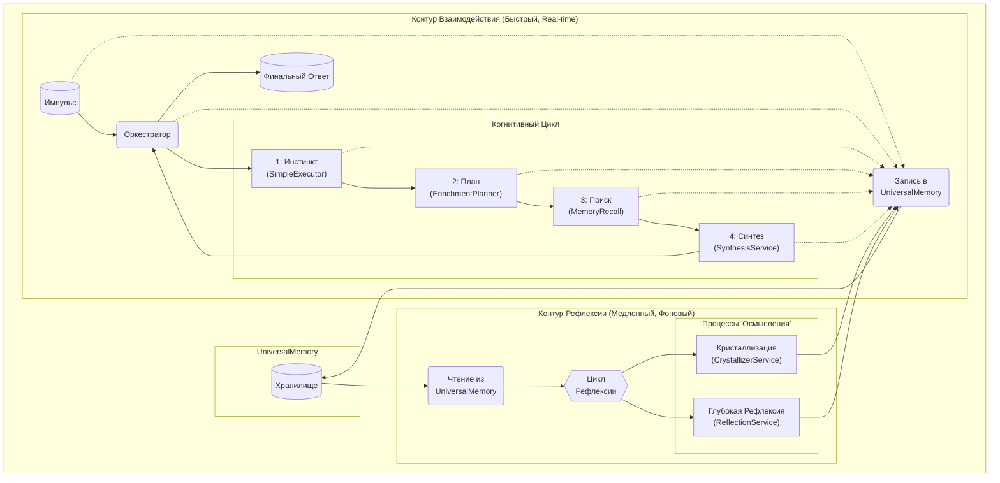
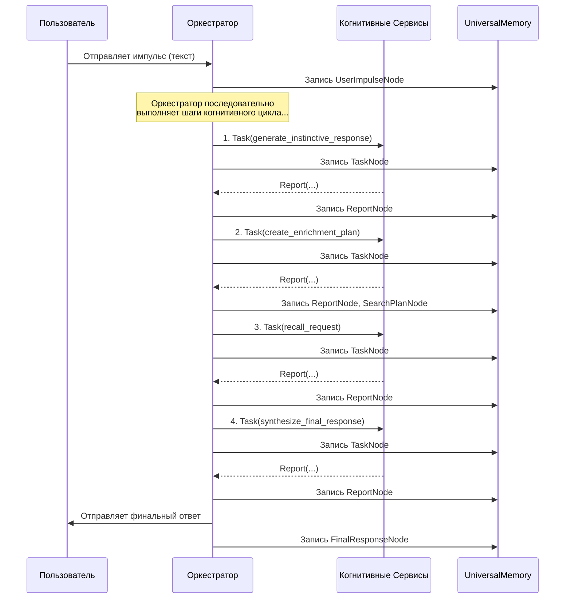
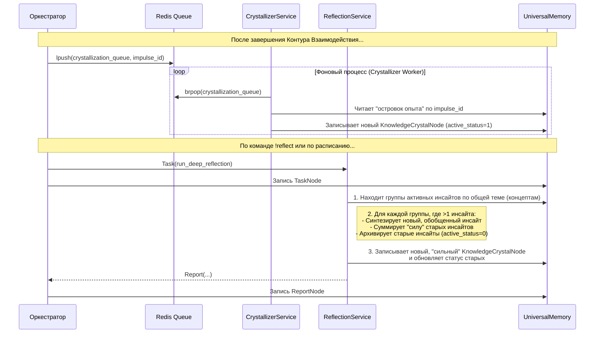

# Архитектура T.H.E.A.

Архитектура T.H.E.A. — это попытка построить stateful-систему вокруг LLM. Вместо того чтобы быть простой "обвязкой", она формирует среду, в которой LLM выступает в роли сменного "когнитивного ядра". Ключевая цель — создать систему, которая оперирует не только сиюминутными запросами, но и накапливает структурированный опыт для его последующего осмысления. Каждый компонент является практической реализацией идей, изложенных в документе **[THEORY.ru.md](./THEORY.ru.md)**.

*Примечание: T.H.E.A. — это активный R&D проект. Описанная здесь архитектура отражает его текущее состояние. Некоторые компоненты могут и будут изменяться, переосмысливаться и дорабатываться в ходе дальнейших исследований.*

---

### Оглавление
*   [1. `UniversalMemory`: Многослойная система памяти](#1-universalmemory-многослойная-система-памяти)
*   [2. Когнитивные Контуры: Два "темпа" мышления](#2-когнитивные-контуры-два-темпа-мышления)
*   [3. Эволюция: Замыкание петли дообучения](#3-эволюция-замыкание-петли-дообучения)
*   [4. Детальные схемы взаимодействия](#4-детальные-схемы-взаимодействия)

---

### 1. `UniversalMemory`: Многослойная система памяти

Центральным элементом системы является `UniversalMemory` — архитектурный паттерн для самоорганизующейся, персистентной памяти.

*   **Текущая Реализация ("Квадро-Память"):**
    1.  **Символический Слой (`networkx`):** Графовая база данных, хранящая явные, структурные связи между сущностями. *("что с чем связано?")*
    2.  **Семантический Слой (`ChromaDB`):** Векторная база данных, обеспечивающая поиск по смысловой близости. *("что на что похоже?")*
    3.  **Темпоральный Слой (JSON-файл):** Хронологический лог всех событий, индексирующий их по временной шкале. *("когда это произошло?")*
    4.  **Концептуальный Слой (реализован в графе):** Этот слой не является отдельной базой данных. Он формируется *внутри* Символического слоя в виде специальных узлов (`ConceptNode`). Эти узлы служат семантическими "якорями", которые связывают разрозненные куски опыта по их общей смысловой принадлежности. *("о чём здесь речь?")*

*   **Принцип Самоорганизации:** Любой "опыт" (импульс пользователя, результат поиска, внутренняя рефлексия) не просто сохраняется, а автоматически ассимилируется и встраивается во все слои. Это позволяет системе со временем формировать устойчивые связи между данными, а не просто накапливать их.

*   **Неизбежное протоколирование:** Каждое действие, каждая задача и каждый результат автоматически записываются в `UniversalMemory`. Запоминание — это не команда, а базовый принцип работы системы. Проанализировать эти сохраненные "мыслительные процессы" можно с помощью инструмента [Когнитивный Трейсер (`trace`)](./ru/02_cognitive_tracer.md).

### 2. Когнитивные Контуры: Два "темпа" мышления

Взаимодействие компонентов организовано в виде двух асинхронных, взаимосвязанных когнитивных контуров, работающих на разных временных масштабах.

*   **Контур Взаимодействия (Быстрый):** Отвечает за реакцию на внешние стимулы в реальном времени. Его задача — обработать импульс пользователя, сформировать и выдать наиболее качественный ответ, используя текущее состояние `UniversalMemory`. Все действия этого контура немедленно записываются в память.

*   **Контур Рефлексии (Медленный):** Это фоновые процессы "осмысления", которые работают с уже накопленным в памяти опытом. Их задача — не отвечать на сиюминутные запросы, а структурировать знания, находить скрытые закономерности и синтезировать новые, более глубокие выводы. Этот контур читает из `UniversalMemory` и **записывает обратно**, тем самым **обогащая и развивая ее**. Результаты работы этого контура — "инсайты" — можно изучить с помощью [Инспектора Знаний (`insights`)](./ru/04_insight_inspector.md).

#### Управление краткосрочной памятью (Контекстное окно)
Для поддержания связности диалога система использует кэш недавних сообщений, который передается в LLM. Чтобы избежать переполнения контекстного окна модели, реализован механизм **"Smart FIFO"**:
1.  Перед обработкой нового запроса система оценивает, не превысит ли суммарный размер кэша и нового сообщения заданный порог (например, 70% от лимита LLM).
2.  Если порог превышен, самая старая пара сообщений ("вопрос-ответ") "выталкивается" из кэша.
3.  Эта "вытолкнутая" пара не просто исчезает, а отправляется на фоновую задачу **дистилляции** (`MemoryCompressorService`), где она сжимается в краткую суть и архивируется в `UniversalMemory` как узел `DialogueTurnNode`.
Это позволяет системе поддерживать долгие диалоги, не теряя контекст и одновременно обогащая долговременную память дистиллированным опытом.

---
### 3. Эволюция: Замыкание петли дообучения

Архитектура T.H.E.A. спроектирована с учётом будущей **эволюции**. Разделение "памяти" (`UniversalMemory`) и "ядра" (LLM) является ключевым механизмом для этого. Цикл "накопление опыта -> дообучение" преследует две цели:

*   **Прагматический Вектор (Оптимизация Системы):**
    *   **Задача:** Создание инструмента для извлечения **"Золотого Датасета"** из `UniversalMemory`. Этот датасет будет содержать не просто пары "вопрос-ответ", а полные когнитивные цепочки (например: `импульс -> сгенерированный_план -> результат_поиска -> финальный_синтез`).
    *   **Цель:** Дообучение **специализированных моделей "Роя"** (если архитектура будет роевой) или одной центральной модели. Основная идея — **научить LLM более эффективно пользоваться своим "телом"**:
        *   Модель-планировщик будет дообучаться на успешных планах, чтобы генерировать более точные и краткие поисковые запросы.
        *   Модель-синтезатор будет учиться лучше работать с результатами поиска из `UniversalMemory`.
    *   **Результат:** Это позволит значительно **упростить системные промпты**, перенеся часть инструкций из текста промпта непосредственно в "поведение" модели, "вшитое" в ее веса.

*   **Исследовательский Вектор ("Перенос Личности"):**
    *   **Задача:** Использовать накопленный уникальный опыт (инсайты, дистиллированные диалоги) для дообучения.
    *   **Цель:** Проверка гипотезы о **"Переносе Личности"** — возможности сохранять и переносить не просто факты, а уникальную "картину мира" и стиль мышления системы на новые, более совершенные "когнитивные ядра" (LLM). Это практический путь к решению проблемы **"катастрофического забывания"** и обеспечению непрерывной **эволюции** системы.

---
### 4. Детальные схемы взаимодействия

#### 4.1. Контур Взаимодействия: Жизненный цикл "Импульс-Ответ"

Эта диаграмма детализирует "быстрый" когнитивный цикл, который запускается в ответ на действие пользователя.

**Текстовое описание:**
1.  **Пользователь -> `Оркестратор`:** `handle_user_impulse` принимает сырой текст и создает в `UniversalMemory` узел `UserImpulseNode`.
2.  **Шаги 1-4:** `Оркестратор` последовательно выполняет шаги когнитивного цикла ("Инстинкт", "План Обогащения", "Поиск", "Синтез"), отправляя `Задачи` соответствующим `Сервисам`.
3.  **Неизбежное протоколирование:** Каждый вызов и каждый результат немедленно протоколируются в `UniversalMemory` путем создания `TaskNode` и `ReportNode`. Это обеспечивает полную "аудируемость" мыслительного процесса.
4.  **`Оркестратор` -> Пользователь:** Финальный ответ, сгенерированный `SynthesisService`, отправляется пользователю и также сохраняется в виде `FinalResponseNode`, связанного с исходным импульсом.

#### 4.2. Контур Рефлексии: Фоновые процессы "Осмысления"

Эта диаграмма показывает, что происходит *после* основного цикла, в "медленном" времени.

**Текстовое описание:**
*   **Автоматическая кристаллизация (Уровень 1):** После каждого диалога `Оркестратор` через Redis асинхронно запускает `CrystallizerService`. Этот сервис проводит "первичное осмысление": он анализирует диалог, находит в нем связи между концептами и создает **новые, "слабые" инсайты** (`KnowledgeCrystalNode` с `active_status=1` и `strength=1`).
*   **Глубокая рефлексия (Уровень 2, по запросу):** Команда `!reflect` запускает `ReflectionService`. Это более глубокий процесс, который работает не с единичным опытом, а со **всей массой накопленных активных инсайтов**. Он ищет инсайты, относящиеся к одной и той же теме (паре концептов), и если находит несколько, то **сливает их**: создает один новый, обобщенный и "сильный" инсайт (с суммарной `strength`), а старые "архивирует" (устанавливает `active_status=0`). Этот цикл "создание -> накопление -> слияние" является механизмом эволюции знаний в системе.
