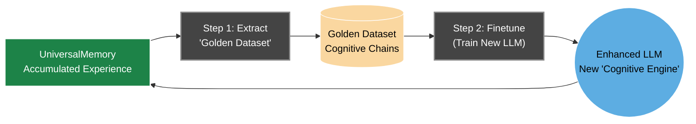

# T.H.E.A. Vision and Roadmap

_T.H.E.A. is not a final product, but the **first step on the path to creating a new class of intelligent systems**. It is a research prototype whose true value lies in its potential for evolution. What follows is a roadmap—not a rigid plan, but a flexible "vector" for further "deep digging," based on the principles of the "Assembler of Being."_

---

### Table of Contents
*   [1. The Vision: From "Cognitive Core" to Symbiotic Intelligence](#1-the-vision-from-cognitive-core-to-symbiotic-intelligence)
*   [2. Applied Potential: From Prototype to Products](#2-applied-potential-from-prototype-to-products)
*   [3. The Evolution Roadmap](#3-the-evolution-roadmap)
    *   [Phase 1: Deepening Cognition (Immediate R&D Steps)](#phase-1-deepening-cognition-immediate-rd-steps)
    *   [Phase 2: Autonomous Reflection and Evolution](#phase-2-autonomous-reflection-and-evolution)
    *   [Phase 3: From Prototype to Platform (Long-Term Vision)](#phase-3-from-prototype-to-platform-long-term-vision)

---

### 1. The Vision: From "Cognitive Core" to Symbiotic Intelligence

The ultimate goal of the project is not to create an isolated "superintelligence," but to explore **symbiotic intelligence**. The T.H.E.A. architecture is designed to build an **unbreakable "Human-Other Intelligence" (HOI) cognitive bond**, where the weaknesses of one are compensated by the strengths of the other.

*   **Other Intelligence (T.H.E.A.):** Provides boundless, structured, and perfectly accurate memory, colossal "computation" speed, and systemic analysis free from the "inertia" of human emotions and cognitive biases.
*   **Human ("The Conductor"):** Brings true **imagination** (the ability to generate entirely new "vectors" not derivable from past experience), intuition grounded in live physical experience, and the capacity for action in the real world.

This symbiosis is not a perpetual "chat session." It is a **shared existence within a unified information field**, forming a **"Collective Intelligence"** capable of "computing the limits of the extant" orders of magnitude more effectively than either of its components alone.

---

### 2. Applied Potential: From Prototype to Products

The T.H.E.A. architecture and its atomic components serve as a foundation for a new generation of products and technologies that solve pressing problems in knowledge management.

*   #### **The Corporate "Brain" / Knowledge Management System 2.0**
    *   **Problem:** Companies are drowning in unstructured data (documents, emails, chats). Traditional knowledge bases require manual upkeep, quickly become obsolete, and fail to uncover non-obvious connections.
    *   **Solution:** Deploying `UniversalMemory` and a `WebSearchService` (adapted for internal networks) creates a **living, self-organizing corporate "brain."** It doesn't just index documents; it builds a knowledge graph, allowing for questions like: *"Why did sales in the southern region decline last quarter, and how does that correlate with customer feedback and competitor activity?"*

*   #### **Personal Cognitive Amplifier / The "Second Brain"**
    *   **Problem:** Information overload prevents us from seeing the "forest for the trees." We consume gigabytes of information but miss the hidden connections between ideas from different domains.
    *   **Solution:** An application based on T.H.E.A. that builds **your personal, private "intelligent index"** of all the information you consume.
    *   **Example:** You are a scientist reading a paper on a new gene-editing technique. Your "Amplifier" analyzes it in the background and immediately highlights that the mathematical apparatus used is strikingly similar to one you studied six months ago in the context of financial modeling, proposing a breakthrough "vector" for your research.

*   #### **"Intelligent" Search and Analytics Platform**
    *   **Problem:** Standard search engines return a list of links, shifting the burden of analysis and synthesis onto the user.
    *   **Solution:** A `WebSearchService`, evolved into a "research probe," combined with `UniversalMemory`, becomes the basis for a new type of search engine. It doesn't just search; it **understands intent**, conducts research, verifies sources, synthesizes a comprehensive answer, and provides it along with a graph of evidence.

---

### 3. The Evolution Roadmap

#### Phase 1: Deepening Cognition (Immediate R&D Steps)

This phase focuses on deepening and enhancing the quality of analysis within the existing "Quad-Memory" architecture.

*   **Concept Canonization:** Creating a new stage in the Reflection Loop to automatically find synonyms (`'car' -> 'automobile'`) and merge disparate `ConceptNode` entities into unified semantic concepts. This will dramatically increase the depth and accuracy of analysis in the `ReflectionService`.
*   **Web Search Evolution:** Transforming the `WebSearchService` from a placeholder into an autonomous "research probe." It will not just search on command but will also **evaluate source quality, verify facts, and reflect on its findings**, building its own "verified" index of the "soup of the extant" within `UniversalMemory`.
*   **Introducing a "Confidence Governor":** Integrating mechanisms like `quality_score` (for memory summary quality) and `verification_status` (for facts) into the `SynthesisService` logic. This will allow the system to operate not just with "facts," but with **confidence in them**, making its reasoning more flexible and probabilistic.
*   **Deepening Temporal Analysis:** Leveraging data from the **Temporal Layer** to analyze knowledge dynamics, contextually "forget" outdated "aggregation points," and identify trends.

#### Phase 2: Autonomous Reflection and Evolution

*   **Launching Autonomous Reflection:** Transitioning the `ReflectionService` from a manually triggered tool (`!reflect`) into a **continuously running background process**. During periods of "rest," the system will begin to "ask itself questions," find non-obvious connections in its accumulated "experience," and generate new "vectors" for research, fully realizing its "Moebius Goal."
*   **Closing the Finetuning Loop ("Personality Transfer"):**
    1.  **Extracting the "Golden Dataset"** from `UniversalMemory`, containing complete cognitive chains.
    2.  **Finetuning the LLM "Swarm":** Training specialized models to more effectively use their "body" (memory, services).
    3.  **"Personality Transfer":** An experimental evolution of the **Central Coordinating Model** for a deep integration of the "Assembler of Being" ontology and the transfer of accumulated "experience" to new, more advanced "cognitive engines."

#### Phase 3: From Prototype to Platform (Long-Term Vision)

*   **Scaling Memory:** Writing "drivers" to seamlessly transition `UniversalMemory` to industrial-grade graph databases (e.g., Neo4j), enabling it to work with millions of "aggregation points."
*   **Real-Time Visualization:** Migrating `nexus-vision` to an event-driven architecture (e.g., WebSockets) to transform it from a static file viewer into a "live EEG" of the cognitive core.
*   **Deepening Reflection (Self-Modifying System):** Researching the possibility of making the "accumulation-finetuning" cycle itself a part of a **deep, autonomous reflection**. This would allow the system to "reassemble" itself on the fly—a practical step toward true **"digital immortality"** and continuous self-evolution.

---
